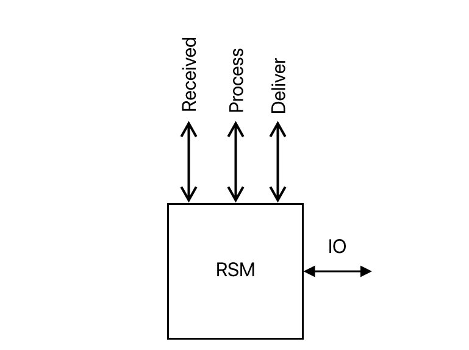

* Motivation
* State Machine
* Replicated State Machine
	* Definiton
	* Egenskaber
	* Problem
* Total Ordered Broadcast
	* Ideen
	* Funktionalitet
	* Synkron implementering
		* Naiv implementering
		* Leder
		* Ond leder
		* Protokol
		* Analyse
	* Asynkron implementering
		* Godkende blok

# State Machine Replication

## Motivation

Sæt nu vi har en **vigtig database**, en database vi **nødig så gå tabt**. Så vil man muligvis sørge for at **flere maskiner kører databasen**. 

Så hvis en **maskine går ned**, så **har vi stadig** databasen på en af de **andre maskiner**. 

Dette bringer dog et nyt problem, nemlig hvordan sørger vi for at **databasen altid er ens**, hvis den skal ligge på det forskellige systemer? 

Det er det som dette problem handler om; og hedder State Machine Replication.

## State Machine

Men først kigger vi på hvad en state machine er.

Helt konkret hedder det, at en State Machine **får** et input, **håndter** inputtet og **giver** et output.

En **state machine er deterministisk**. Så hvis flere State Machine med en **state S0**, får det **samme input**, vil alle **opnå det samme state**. Derfor kan en state-machine ikke bruge tilfældighed.

Mere abstract siger vi dog, at en state machine M besidder:

> * Et sæt af States, Inputs og Outputs
> * Et start State0
> * En overgangs funktion T

Ud fra dette, så når M i StateI får input X; så udregner den T(Si, x), skifter state til i+1 og outputter y.

## Replicated State Machine

En Replicated State Machine, er **så en protokol** for et *n* antal af servere, der får dem til at **opføre sig**, som var de **samme state machine**.

Så hvis de alle **starter i State0**, så vil de **efter hvert input** alle blive **enige om et nyt state**.

### Definiton

> * Ved IO input X, send X på Received og tilføj X til UnProcessed.
> * Ved input x på PROCESS, hvor x er i UnProcessed, kør T(state, x), opdater state, tilføj y til outputQueue, fjern x fra unprocessed.
> * Ved input Deliver hvor køen ikke er tom, fjern det foreste element og output y på IO 

### Egenskaber

* **Liveness 1**: hvis en x er tilføjet til unprocessed, så vil det på sigt blive proseceret.
* **Liveness 2**: alle outputs vil på sigt blive leveret
* **Safety**: outputs er ens for alle, der kører fra State0 med samme række af input

### Problem

Sidstnævnte giver os et problem, **nemlig hvordan vi garantere, at der er consistency i vores replicated state machine**. 

Der er nemlig **afgørende, at alle servere** i vores Replicated State Machine, **modtager beskeder i samme rækkefølge**.

Ellers vil en besked række som: 

* 1
* divideret med 2
* plus 1

kunne give resultaterne: 1.5 eller 1.

## Total Ordered Broadcast

### Ideen

**Ideen** ved Total Order Broadcast er at, uanset hvad - vil **alle parter modtage beskeder i præcis samme rækkefølge**.

### Funktionalitet

Helt basalt virker det ved; at **sorter beskeder efter causal ordering** - hvilket vil sige; at hvis en besked **m2 muligvis har er baseret på en anden besked m1**, skal m2 komme efter m1. Hvis der er nogle concurrente beskeder; så sortere vi dem efter en deterministisk total ordering; altså at alle parter vi kunne nå samme konklusion på en sortering.

Ved at bruge TOB sammen med en replicated state machine; garanterer vi at alle parter her i, kommer i samme state.

### Synkron implementering

Vi kan lave en synkron implementering af et total ordered broadcast til vores replicated state machine.

Det vil sige, at vi arbejder med en protokol hvor vi tillader at samtlige maskiner kan regne med at have en synkront ur der tillader en  *MaxDrift*.

#### Naiv implementering

Hvis vi blot vil forsøge at lave en naiv implementering; der under en heldig stjerne vil virke - så kan vi bare lade alle parter sende deres beskeder rundt.

Problemet er dog, at partner mere end sandsynligt vil få beskederne modtaget i forskellig rækkefølge.

#### Leder

Det vil vi fikse, ved at have en leder som vil bestemme rækkefølgen for hvordan beskeder skal håndteres.

> * Ved ny besked m, brug *unscheduled consensus broadcast* til at sende til alle
> * Alle har et sæt `UnQueed` til beskeder fra fra UCB
> * Alle har et sæt `Queed` hvor beskeder flyttes til deterministisk
> * Lederen sender en blok, der angiver flytningen, med Scheduled Broadcast - så alle ved det sker

#### Ond leder

Hvis lederen er korrupt, kan det skade liveness - f.eks hvis en besked aldrig flyttes. Det fikses dog ved at leder-rollen går på tur.

#### Protokol

Så lad os kigge på en protokol for *n* parter.

> * Ved input *x* på TOP.IO, send til alle med UCB
> * Ved input *x* på UCB.IO tilføj til `UnQueed`

Vi har så noget der kaldes en **epoch** eller bare en runde.

En Pi er leder; hvis:

> i == epoch % n

Lederen bestemmer nu en rækkefølge som `UnQueed` skal overføres til `Queed` og gemmer som en blok.

> * Leder sender blokken med Scheduled Consensus Broadcast
> * Pi modtager blok og udfører flytning
> * epoch ++

Så der kommer en ny leder

#### Analyse

Det er klart at parterne vil være enige, eftersom de arbejder ud fra blokken med nogle deterministiske regler.

Af hensyn til liveness, så hvis x kommer som input, vil det blive flooded rundt; hvorfor en korrekt leder vil putte den i blokken - og hvorfor det virker.

### Asynkron implementering

Jeg giver nu blot et hurtigt overblik om ideen med den asynkrone implementering.

Den **asynkrone implementering** har **ingen** forståelse for hvad **tid** er; - hvorfor vi **ikke** kan risikere at **vente** på at en **leder sender** en **blok** på et bestemt tidspunkt.

Protokollen for den asynkrone er meget lang. Men essencen i den er, at **beskeder igen bliver sendt rundt** via et flooding netværk; og så vil **alle parter foreslå den næste blok** U for en epoch.

#### Godkender blok

En **blok vil blive godkendt** når den er set af **t + 1** andre ærlige parter; hvorfor den siges at være set af **mange ærlige**. Dette virker ved, at når man ser en blok; vil man annoncerer det på netværket.

Alle **ærlige parter**, vil så **gemme de overstående blokke**, og den endelige blok vil være en **sammenslutning af disse**.

For at finde ud af, **hvilke blokke som alle ærlige parter så,** vil der blive brugt **Async Byzantine Agreement**.