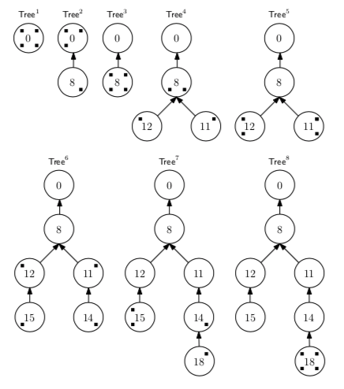

* Motivation
* Totally Ordered Broadcast
	* Ideen
	* Blochchain løsning
	* Cryptocurrencies
* Blockchains
	* Lotteri system
	* Vinde puljen
	* Hardness værdi
	* Proof of stake
		* Tickets
		* Første runde
		* Anden runde
		* Pulje J
		* Sikkerhed: DDOS og SEED
	* Gro et træ
		* Bedste sti
		* Eksempel
		* Rollback

# Blockchain, Growing a tree

## Motivation

En blockchain er en åben måde at holde styr på vigtig data på. Det tillader alle at tjekke og garantere dens data; og den er meget svær at manipulere med.

## Totally Ordered Broadcast

Blockchain er blot en af mange måder at implementere Totally Ordered Broadcast på.

### Ideen

**Ideen** ved Total Order Broadcast er at, uanset hvad - vil **alle parter modtage beskeder i præcis samme rækkefølge**.

> TOB: samme rækkefølge for alle

Helt basalt virker det ved; at **sorter beskeder efter causal ordering** - hvilket vil sige; at hvis en besked **m2 muligvis har er baseret på en anden besked m1**, skal m2 komme efter m1. Hvis der er nogle **concurrente** beskeder; så sortere vi dem efter en **deterministisk total ordering**; altså at alle parter vi kunne **nå samme konklusion på en sortering**.

### Blochchain løsning

En **blockchain** er er **rimelig selvforklarende** for hvordan den løser dette problem; den har simpelthen en **lænke af disse blokke** og dets beskeder.

Flere forskellige **parter vil have** disse lænker; eller også kaldt **træer. Ideen er baseret på State Machine Replicatation,** hvor en gruppe af maskiner skal forsøge at blive enige om et evigt-voksende sæt af operationer.

### Cryptocurrencies

Dette bliver i disse dage, populært **brugt til at lave cryptocurrencies med**. Hvis man arbejder med, at de operationer der sendes frem og tilbage, blot er **transaktioner** - kan man kort beskrevet **lave en digital valuta**.

At **cryptocurrencies** er **baseret** på **TOB** er faktisk en **meget vigtig ting**. Tager vi i betragtning de afleveringer vi har haft i kurset, så har en **konto ikke må gå i negativ**; så det betyder noget for hvilken **rækkefølge at transaktioner kommer i** - derfor betyder det også noget at alle parter der deltager i bogføringen af disse valutaer, **modtager transaktionerne i den samme rækkefølge**.

## Blockchains

> **Blockchain**

Vi har et peer-to-peer network, hvor beskeder bliver sendt rundt ved flooding.

> * Peers kan komme og gå

Vi tillader at nodes bare kan komme og gå; hvorfor vi ikke bare kan lade en lederrolle gå på skift; eftersom en langsomtids bruger måske aldrig bliver valgt.

> * Sequeencer går på skifter

Derimod bruger vi et lotteri til at bestemme sequencer. Man **kan vinde i en** række forskellige slot-numre, eller **puljer** kan vi kalde dem, der hver i sær varer et hvis stykke tid. 

Det er **derfor implementeringen er synkron**, da vi **basere** vores forskellige **puljer på** en fælles forståelse for **tid**.

### Lotteri system

Så det her er jo basicly hvad det er vi sad og programmerede og svedte over i de sidste dage inden vi kunne gå på juleferie; det var en krævende - men dog sjov aflevering! Så jeg burde vide noget om hvordan det virker. Men lad os nu se.

#### Vinde puljen

Efterhånden som tiden går, vil man være i en pulje **angivet af et nummer**. Hvis  men vil vinde puljen, så gøres det ved at:

> * **Vinde pulje**
> * Signere pulje-nummet
> * Hash det

Er ens hash så større end en given hardness, har man vundet.

> hash > hardness

Hvilket altså vil sige, at der for hver pulje kan være **flere vindere**.

#### Hardness værdi

Den her hardness værdi

> **Hardness værdi**

er en given værdi der skal sørge for - at der 

> * findes en vinder ved et givent interval 

det gør også at færre vinder hvorfor mindre trafik; men at det kan ende med; 

> * nogle puljer har ingen vinder

#### Proof of stake

##### Tickets
Vi siger at **hver part har en antal tickets** - hvis det var en cryptocurrency kunne det f.eks være antallet man havde af mønter. 

Disse tickets er en faktor der bliver **ganget på ens hash**; hvorfor des flere tickets des højere mulighed har man for at vinde. 

> Tickets: des flere, des større vinder chancer

Det giver **meningen i den forstand**, at hvis man som bruger af den af cryptocurrency; så giver det mening at vinde hvis man har en stor opsparing - da **man ønsker at holde valutaen i live**.

##### Første runde
> **Første runde**

I første runde så laver alle et **key-pair** (vk, sk) til et signatur skema; hvor **vk er broadcastet** ud til alle andre parter.

> * Alle  laver (vk, sk)
> * Alle sender vk

##### Anden runde
> **Anden runde**

I runder nummer to, bliver der **sendt** et såkaldt **Seed** rundt til alle. Dette nummer skal **ikke være muligt** for parterne at **forudsige** i runde 1 - mere om det senere.

> * Seed sendes

Nu er alt sat op, og magnuses-blockchain-lottery kan åbne! Yay! 

##### Pulje J

For hver pulje j, kan hver part trække et nummer. Det regnes ved at sige:

> **Pulje J**

> * Pi trækker: `draw = SIGN(seed, j)`
> * Værdien er: `value = tickets * H(seed, j, draw)`

Er værdien høj nok, sender man en blok ud med ens draw

##### Sikkerhed: DDOS og SEED

Det smarte ved det her system, er at **kun parten der kender sin secrete-key kan udregne sit draw,** men alle der har ens verifycation-key kan udregne om ens draw er korrekt.

Derfor kan **andre ikke vide hvem der har vundet** - indtil at man selv vælger at offentliggøre det. Dermed er systemet, designet til at **modstå et DoS angreb**; hvor en fremmed - vil forsøge at **crashe en vinder**.

For sæt nu at en fremmed kunne udregne alle vindere af systemet, så kunne han fokusere på at crashe alle disse - hvorfor han ville dræbe liveness af systemet.

Det bringer os tilbage til at **snakke om det her Seed** der først bliver offenligt i anden runde. Det er vigtigt at det først kommer efter, at hver part har lavet sine nøgler; for ellers ville en part kunne **lave en nøgle**, der med alt sandsynlighed **gav høje lodtrækninger** i nogle ønskede runder.

### Gro et træ

**Når man vinder**, så **sender** man sammen med sin **draw, en blok** ud - der indeholder hvilken rækkefølge man mener beskeder skal arbejdes med i; samt **hvilken blok der er dens forældre**.

**Som ærlig part**, vil man altid bygge videre på den sti man finder bedst. Så på den måde bestemmer man en bloks forældre.

Når man modtager sådan en blok, vil så kigge påsætte den på dens retmæssige forældre - såfremt man finder den gyldig. Derved opbygges et træ.

#### Bedste sti

Ud fra en rod vil et træ vokse, hvor disse blokke altså påsættes. Men når en blok kan have flere børn; **hvordan ved en part så; hvad den skal se som den bedste sti af træet?** 

Med andre ord, når vi har et træ med en masse forskellig data - hvad ser vi så som vores **state eller vores nuværende resultat**?

Hvis vi siger at hvert leaf har en **leaf weight**; så vil hver part tage den simple vej fra roden der har den **største samlede vægt**. 

Hvis der er den samme vægt for alle blade, vil det derved være den **længste path** som er den optimale - fordi ja ... størrelsen er gørelsen 😏 (penis joke). Man vil **altid bygge videre på den path man ser bedst**.

#### Eksempel

1. Alle er enige om roden
2. En vinder pulje 8, men kun den ved det
3. Alle ved nu pulje 8 blev vundet og ser det som den bedste path
4. En vinder pulje 11, og før en anden ser det vinder den pulje 12
5. Alle andre ser nu dette og bliver splittet
6. Der bliver vundet en pulje fra hver split
7. En i splittet vinder
8. Alle ser nu dette som den længste

Hvorfor vi nu har, at de agreer! YAY!

#### Rollback 

Hvad der lige skete her, er hvad vi kalder for et rollback. Og det kan desværre også åbne op for nogle angreb. 

Sæt nu; at vi har, at nogle fremmede havde vundet nogle runder; men ikke havde offenlig gjort dem; når de så havde vundet tilpas mange der udgjorde den samlede længste path i træet, kunne de publicere dem og alle vil nu flytte her over.

Man kan f.eks bekæmpe dette, med at angive hvor langt et rollback maksimalt må være; men dette kan ligeledes også give problemer. 

For sæt nu at tre parter har tre blade og til roden, og en fjerde part lige havde vundet - så den havde fire blade der op. Så kunne et ghost tree på 5 blive sat op på roden; og hvis max-rollback er tre; vil de tre kunne gå på ghost-vejen, men aldrig den fjerde. Hvorfor de nu er splittet og hvorfor der nu aldrig vil kunne komme agreement igen.