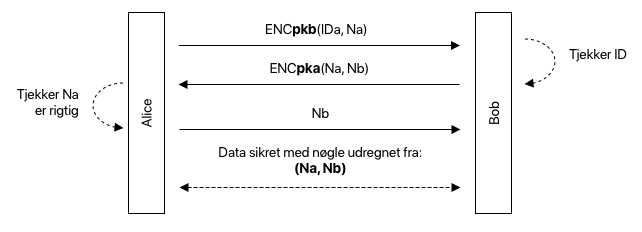
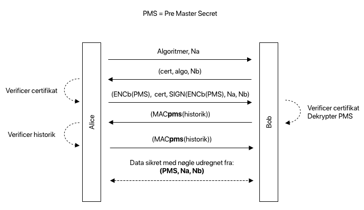
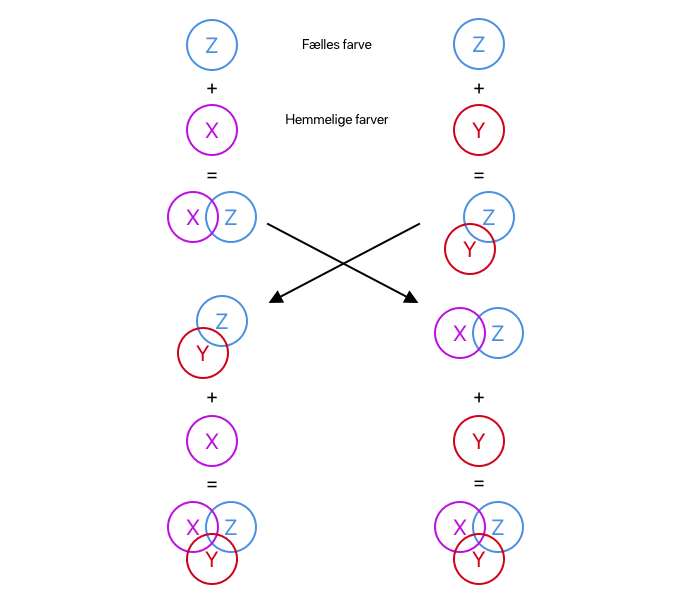

* Motivation
* Authenticated Key Exchange
	* Lave sikker kommunikation
	* Egenskaber
* Needham / Schroeder
	* Udnyttelses angreb
* SSL
	* SSL Handshake
* IPSec
	* Diffie-Hellman key exchange
* SSL vs IPSec
* Password key exchange
	* Problem

# Network Security Mechanisms
_Motivation_

Så det vi kender som internettet, er i bund og grund et **meget usikkert sted**; og man kan "nemt" som en fremmed **se hvad der sendes** frem og tilbage; nogle gange vil det dertil også være **muligt at ændre** på det.

Det kan **løses** ved at kommunikere igennem "**sikre tunneler**" over internettet; som jeg gerne vil snakke om; og hvordan de bruges og laves.

## 1. Authenticated Key Exchange
### 1.1 Lave sikker kommunikation

Hvis vi gerne vil have en sikker kommunikation, bruger vi en protokol kaldet **autentificeret nøgle udveksling**.

Ideen er at, at to parter der har hinandens certifikater og ved hjælp af dem, **ønsker at blive enige om en session key**.

En session key, er en midlertidig key man bruger til kommunikation. Det har følgende fordele:

> * **Session Key**
> * Secret Key => Hurtig
> * Mere sikker, da nøglen konstant udbyttes

### 1.2 Egenskaber

Helt konkret er det en protokol for to parter; hvor den bliver startet med intentionen om at etablere en key med den anden part. 

Ved enden af protokollen skal hver part godkende og outputte keyen.

Protokollen har nogle betingelser:

> * **Agreement** Hvis A vil snakke med B og omvendt; samt de begge acceptere og outputter en key - vil de keys være ens.
> * **Secrecy** and Authentication Hvis A vil snakke med B og A acceptere; så deltog B; og hvis B accepterede ville B og snakke med A. Ligeledes kender en fremmed hverken keyen fra A eller B.
> * **Freshness** Hvis der udstedes en nøgle, skal den være ny

## 2. Needham / Schroeder
Needham og Schroeder præsenterede engang en sådan protokol. 

Den gik således:

> * A krypter (IDa, Na), under PKb og sender
> * B dekryptere, tjekker id og sender (Na, Nb) under PKa
> * A dekryptere og tjekker Na er rigtig og sender Nb tilbage
> * B godkender Nb
> * Begge lever en key fra Na og Nb

Hvor Na og Nb er nonces.

### 2.1 Udnyttelses angreb

Men denne protokol, viste sig ikke at være rigtig.

Hvis vi forestiller os; at en tredje part **E var blevet banlyst af B**.

> E ⇢ | B

Når A forsøger at kontakte E, kan E sende disse forespørgelser videre til B; der blot tror det er A.

> A ⇢ E ⇢ B

Så kan E udnytte A, til at opnå en sikker forbindelse med B, alt imens B tror den snakker med A.

## 3. SSL 

En protokol der virker, og som ofte bruges er SSL.

> Secure Socket Layer Protocol

I dag er det dog TLS, men den bliver bare kaldt SSL også.

> TLS ≅ SSL

### 3.1 SSL Handshake

SSL bruger flere forskellige protokoller for at virke, men den der står for Authenticated Key Exchange hedder "Handshake Protocol". 

Den virker ved at **clienten sender** en liste af **kryptoalgoritmer rangeret** som den gerne vil bruge; **serveren svarer** så hvilken en de skal bruge. Så sker key-exchange.

Ideen ligger i at:

* Serveren beviser den kunne udtrække PMS, ved at sende en MAC af historikken
* Clienten beviser den kunne kryptere PMS
* Client beviser dens historik

Ved at MAC deres **respektive views** af samtalen, kan de bevise at de **havde den samme samtale**, og at intet var ændret.

Dette tvinger en **fremmed til kun at kunne forwarde beskeder, og ikke ændre dem**.

I bund og grund virker SSL mellem en Server og en Client; **men kan være et-vejs** i det kun at serveren har et certfikat. Dette er **typisk for hjemmesider** og vil blive diskuteret senere. Men sikkerheden ligger i signatur + kryptering af deres beviser om historikken. 

## 4. IPSec 

IPSec er en række af protokoller der gør nogenlunde det **samme som SSL** gør; men det sker på et **lavere niveau**; nemlig nede i **transport laget**. 

Det vil sige, at selve **forbindelsen mellem to IP'er** vil blive **sikker**. Alt dataen derimod fra samme IP går igennem samme tunnel. **IPSec** bruger Internet Key Exchange, som også er **public-key authenticated**, bare via Diffie Hellman Key Exchange.

### 4.1 Diffie-Hellman key exchange

Forstiller vi os at det følgende repræsentere Diffie Hellman, og at det blot ligeså er authenticated med public-key; så vil jeg gerne forklare det ved hjælp af farver; hvordan de bliver enige om en key.

* De starter med en fælles engangsfarve Z
* Vælger hver i sær en hemmelig farve (X og Y) som de blander i.
* Sender blandingen til hinanden public
* Den blanding de får tilsendt tilsætter de nu deres egen private farve i (X og y)
* De har nu begge X + Y + Z.

## 5. SSL vs IPSec

Det er forskelligt hvornår man bruger hvad; og det kommer an på sitautionen. 

Men fordi IPSec via på transport lageret; så lige så snart det kommer til **netværks-adapteren**, så er forbindelsen **ikke sikker** mere; så det kræver man stoler på sin egen hardware - derimod så kan **alle applikationer** på computeren nu bruge den tunnel.

For **SSL** er man beskyttet helt op til **applikations laget**; hvilket betyder man er imun fra spyware osv.

|  | IPSec | SSL |
|---|---|---|
| **Sikkerhed** | Netværks-adapter | Applikation |
| **Fordele** | Kan bruges af flere | Imun for spyware mm. |
| **Ulemper** | Kræver man stoler på hardware | |

## 6. Password key exchange

Som jeg nævnte før ved SSL, kan vi have det som one-way; hvor det **kun er Serveren der har et certificat** - og at det faktisk er det der **oftest sker med hjemmesider** etc. 

Derfor bliver man på mange hjemmesider nød til at angive sig selv med en **bruger og et password**.

### 6.1 Problem

Men hvad er problemet så? Fordi at passwordet ikke er en central del af en protokol; mener nogle at sikkerheden derfor kun er baseret på passwordet - hvorfor de ligeså mener man bør designe en protokol omkring passwordet.

Men at have en kryptering der kun er baseret på et long-term password, er usikkert; da en fremmed kan opsnappe noget ciphertekst og bruteforce koden offline - for derefter at bruge koden online.

Password Authenticated Key Exchange virker nogenlunde ligesom Deffie; men bruger ens password til at kryptere kommunikationen - så man i sidste ende kan blive enige om en ny key som man fremadrettet bruger.