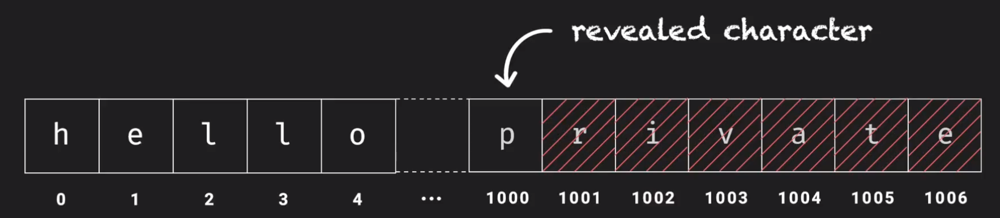

* Taxonomy
	* Hvordan der angribes, X.8000
	* Hvorfor der angribes, STRIDE
	* Hvor der angribes og af hvem, EINOO
	* Hvorfor muligt? TPM
* Illegalt Input Angreb, gennemgang
	* Overflow angreb
	* Cross Site Scripting
	* Heart Bleed
* Spectre, dybde
	* Speculative Execution
	* Problemet
	* Eksempel
		* Gemme i cachen
		* Læse fra cachen

# Threats and Pitfalls

_Motivation_

Når vi tænker på IT-systemer, skal vi altid **overveje sikkerhed**. Derfor arbejder vi med en **Thread Model**.

> **Thread Model**
> 
> * Hvilke trusler vi tager os af
> * Hvilken grader vi tager os af dem
> * Mængden af forsvar mod dem

## Taxonomy

Der er en række forskellige måder at definere angreb på, betegnet med følgende modeller.

### 1.1 Hvordan der angribes, X.8000

Der er flere måder at kategoriser et angreb på. X.800 standarten angiver to typer angreb over en netværks transmission: Passive og Active angreb.

| Aktive | Passive |
|:--|:--|
| Replay | Aflytning |
| Blocking | Analyse |
| Modification | |

Det er klart at passive angreb er svære at opdage. Aflytning kan dog stoppes ved at bruge kryptering. 

Aktive angreb er nemmere at opdage, men sværere at forhindre.

### 1.2 Hvorfor der angribes, STRIDE

Forskellige angreb kan have forskellige mål. STRIDE betegner de forskellige angrebstyper og deres mål, og er en forkortelse for:

> * **Spoofing Identity**: Imitere en bruger
> * **Tempering**: ændre på data uden det opdages
> * **Repudiation**: gøre noget; uden at det kan bevises
> * **Information Disclosure**: se fortroligt data
> * **Denial of service**: DDOS
> * **Elevation of privilege**: give sig selv flere rettigheder

Det skal dog nævnes, at et angreb sagtens kan høre under flere af disse betegnelser. 

En man-in-the-middle angreb vil ofte f.eks både btegnes som "Spoofing Identity" og "Information Disclosure"

### 1.3 Hvor der angribes og af hvem, EINOO

En helt tredje måde at betegne et angreb på, er via EINOO. De to første betegner hvem:

> * **External attackers**
> * **Internal attackers**

Hvor der bliver angrebet:

> * **Network attacks**
> * **Offline attacks**
> * **Online attacks**

### 1.4 Hvorfor muligt? TPM

En sidste måde at kategorier angreb på er via TPM, som betegner hvorfor det var muligt:

> * **Thread model**: vi forudså ikke dette angreb
> * **Policy**: vores sikkerheds politik var ikke god nok
> * **Mechanism**: vores mekanismer var ikke tilstrækkelige.

## 2. Illegalt Input Angreb, gennemgang

Mange IT systemer tager input fra brugeren; og hvis disse inputs ikke håndteres korrekt - kan de udnyttes til at udføre angreb.

### 2.1 Overflow angreb

Vi får input der er længere end forventet. I sprog som C kan dette være en problem.

> **Overflow angreb**

Forsøges et input at gemmes i et **array der ikke er langt nok**; vil det overskydende **overskrive hukommelsen** uden for arrayet.

> * Overskrive hukommelse

Dette kan f.eks få programmet til at crashe - men kan en angriber selv bestemme input; kan angriberen **ligge farlig data i hukommelsen**.

> * Styre computeren

Det kunne f.eks være; at det var muligt i et program at **overskrive en stacks return** address og dermed bestemme med input data; hvor computeren skal køre efter en funktion er udført. Hvilket kan være yderst farligt.

Aktivt angreb: modification 

### 2.2 Cross Site Scripting

Hvis en hjemmeside kan tage imod bruger-input, og på en anden side udskriver selv samme input; så kan et sådant input indeholde javascript-kode, som browseren vil køre.

Dette bliver først rigtig farligt; når en ond hjemmeside vælger at sende brugeren hen til den anden naive hjemmeside der udskriver inputtet. Fra brugerens og browserens synpunkt; ser det ud som at javascriptet kommer fra den naive side hvorfor javascripten pludselig har adgang til den naive hjemmesides data. Det kan javascripten nu sende videre; helt uden at man opdager noget.

Aktivt angreb: Modification 

Stride: Spoofing Identity, Tempering, Repudiation og Information Disclosure

EINOO: ekstern, online

### 2.3 Heart Bleed

Heart Bleed var en bug der var i OpenSSL. Man udnyttede at man i SSL bruger et heartbeat, til at tjekke at en server stadig er i live. 

Dette gøres ved at sende et nonce og dets længde. Serveren vil så gemme dette nonce i et array; og udskrive fra arrayet så langt som længden der blev sendt - og sende det samme tilbage. 

I hele to år, glemte man at tjekke om længden der blev sendt rent faktisk matchede; og derved kunne man sende en længde der var længere end selve noncet; og derved få serveren til at sende noget af dens interne memory tilbage.

## 3. Spectre, dybde
### 3.1 Speculative Execution

Moderne CPU **ramte et loft** da de kom op omkring 4Ghz, og producenter måtte finde andre måder at forhøje hastighederne på. 

Dette ledte til at **speculative execution** blev opfundet; hvor at en CPU vil **prøve at gætte hvad den skal i udføre i fremtiden**; hvis den lige pludselig får mulighed for at udføre noget **imens den venter** på noget andet.

Den kunne skulle **vente fordi, den skulle bruge noget data** som den ikke havde i dens egen cache men først måtte **hente fra RAM**. Når noget bliver hentet fra RAM, bliver det **lagt ind i cachen** som er langt hurtigere, som CPU'en så bare internt bruger.

Det vil sige, **hvis en CPU gætter rigtigt** om hvad den skal udføre i fremtiden, og den allerede har udført disse og lagt deres resultater i sin cache, er disse **resultater hurtigt tilgængelig**.

### 3.2 Problemet

Fejlen som SPECTRE handler om; finder sig i; at **disse spekulative operationer ikke får slettet deres resultater fra cachen**; og man må den måde kan **udnytte** speculative thinking til at **få fat i information**, man ellers ikke vil kunne tilgå.

Dette kunne for eksempel ske ved et **multi-user system** på en computer, eller ved noget så simpelt som **to taps i en browser**.

### 3.3 Eksempel
#### 3.3.1 Gemme i cachen
```
data = [1, 2, 3, 4] // et vilkårligt set af information

input = 1000 // Et tal større end data.size

if (input < data.size) {
	secret = data[input]
}
```

I overstående eksempel, **kender CPU'en ikke værdien af data.size**, så den vil spørge RAM om dette - hvilket tager tid. 

Derfor vil `secret` nu komme til at indeholde `data[1000]` - såfremt den tror `if` vil blive sand (kunne være angriberen havde kørt det mange gange, hvor det havde været sandt).



`data` er ikke 1000 langt, så noget andet fortroligt data vil blive taget; da data i memoryen ligger lige efter hinanden som et langt array.

Men data.size kommer nu tilbage til CPU'en og den finder ud af if-sætningen ikke vil være sand; dog fjerner den ikke hvad den lagde i cachen.

#### 3.3.2 Læse fra cachen

Nu er angriberens næste job, at finde en måde at læse fra cachen.

```
chars = [a, b, c, d, ..., z] // Alle mulige karakter

for i in chars.index
	chars[i] // læs; hvilket propper i cachen
	chars[secret] // kort tid: vi fandt hvad gemt i cachen; lang tid - læst fra ram, prøv igen
```

Så vi indlæser en efter en, de forskellige karakter ind i cachen; og efter hver indlæsning forsøger vi at indlæse `chars[secrete]`.

Hvis det går hurtigt er det fordi vi netop har indlæst den; hvorfor vi nu ved hvad der stod på `data[1000]`.

Det her er bestemt Information Disclosure fra STRIDE; og et online attack udført af en insider.