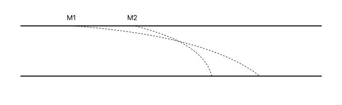
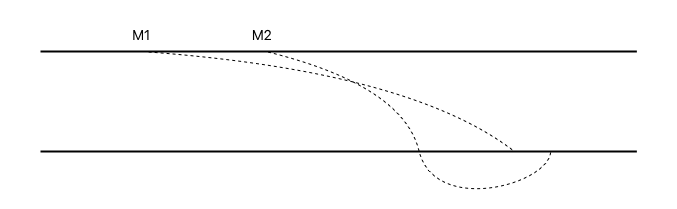

* Motivation
	* Joke
	* Unstructured Peer-to-Peer
* Antagelser for fix
	* Liveness
	* Funktioner
* FIFO
	* Problem
* Causal
	* Causal Past Relation
	* Protokol
	* Vector Clocks
* Total Order
	* Fremgangsmåde
	* At vente eller ej
	* PING

# Consistency

## Motivation
### Joke

"Kong Kurs"

"Hvad hedder den fattigste konge i verden?"

.. oh.. hov, det skulle jeg have sagt omvendt! Så hvad der lige skete var, at min hjerne sendte signaler til min mund om at sige det korrekt; men jeg modtog det ikke i den rigtige rækkefølge og derved ødelagde joken. Det må i undskylde!

### Unstructured Peer-to-Peer

Det var et eksempel på hvad der kan ske når vi har et unstructured peer-to-peer netværk.

Hvis en besked B er afhængig af A, men B bliver modtaget før A; så har vi et problem.

## Antagelser for fix

For at vi kan få en konsistent model, skal vi have nogle **antagelser på plads** om det pågældende system og hvad det kan.

Vi antager at systemet har mulighed for **flooding**, altså at hvis en korrekt part sender en beskeder, vil den på sigt ankomme ved alle andre korrekte parter. 

### Liveness

Dette er en egenskab vi kalder for **Liveness**.

> * **Liveness**: Hvis en korrekt Pi sender (Pi, m), så på sigt vil alle korrekt Pj levere (Pi, m)

### Funktioner

Dette kan ske, grundet at systemet har følgende egenskaber:

> * **Send**: En korrekt part Pi kan få input (Pi, m); hvor efter Pi skal sende det til alle
> * **Deliver**: Hvis Pi outputter (Pj, m), leverede Pi for Pj

Med dette skal vi nu kigge på tre forskellige måder at garantere consistency: FIFO, Causality og Total Order. **Vi går ud fra at alle parter er korrekte**.

## FIFO

Står for:

> **FIFO**: First in, first out

Kommunikationen i FIFO holder den rækkefølge de sendes i fra forskellige parter. 

Så hvis en **Pi sender to beskeder**; modtager alle andre det i den **rækkefølge**. Men hvis **en Pi og en Pj** sender tæt på hinanden, modtager alle **ikke** i **samme rækkefølge**.

> * Korrekt Pi sender (Pi, m) og (Pi, m*), så vil en korrekt Pj der levere (Pi, m*) tidligere have leveret (Pi, m)

Det **virker** ved, at systemet holder **styr på antallet** af beskeder fra en Pi; og levere beskeder herefter.

### Problem

FIFO garanter **kun at beskeder fra den samme part leveres i den rette rækkefølge**, derved kan en **tredje observatør** ikke vide hvilken rækkefølge P1 og P2’s beskeder skal komme i - måske et svar kommer før et spørgsmålet.

## Causal

Causality er en anden protokol, der **uanset afsender** - så vil beskeder der depender på en anden - altid komme i rigtig rækkefølge.

> **Kausal**: Rumme årsagen til noget

For at vi kan skal vi dog have noget nyt termologi; til at beskrive hvornår event måske er kausal relateret.

### Causal Past Relation

> **‌(Pi, mi) ↪ (Pj, mj)**: betyder at Mj måske er afhængig af Mi.

Medmindre vi kan garantere dette ikke er tilfældet, siger vi at en besked har en kausal relation til en tidligere.

Men da en besked kan have mange kausal relationer, har vi også betegnelsen:

> **CP(Pi, Mi)**: betegner sættet som (Pi, Mi) har en kausal relation til

### Protokol

Det viser sig så, at en **protokol bygget** med **Causal Past Relationer** er meget **ineffektiv**.

* Ved input SEND (Pi, m)
	* Tilføj til CP(Pi)
	* CP(Pi, Mi) = CP(Pi)
	* Send (Pi, Mi, CP(Pi, Mi))
* Pi modtager (Pj, m) sammen med CP(Pj, m)
	* Vent indtil Pi har leveret alle i CP(Pj, m) (minus (pj, m))
	* Så levere (Pj, m)
	* Tilføj til CP(Pi)

Protokollen **har liveness, da den venter** på en causal past, før den levere en besked. Men vi **bemærker**, at protokollen sender mange beskeder, som giver ekstra trafik.

### Vector Clocks

Ved at bruge **vektor klokke**, kan vi **undgå at sende hele historikker** af beskeder med.

**Vektor klokke bygger på FIFO**, om at holde styr på **antallet af modtagede beskeder**. Som man så **sender med rundt**.

> * **VektorClock(Pi)** af integers. 
> * VC(Pi)[k] er antallet modtaget fra Pk.

Hver part har så også en 
> **Deliveret(Pi)[PK]**

Og **når man modtager** en (Pi, m, vc) vil man så levere den når den *vc* matcher ens deliveret.

Logikken er primært den samme, men loaded er meget mindre.

## Total Order

Ideen ved Total Order Broadcast er at, uanset hvad - vil **alle parter modtage beskeder i præcis samme rækkefølge**. Det kan f.eks være nødvendigt for **State Machine Replication**.

### Fremgangsmåde

Helt basalt virker det ved; at **sorter beskeder efter causal ordering** som vi gennemgik før; og hvis der er **nogle concurrente** beskeder; så sortere vi dem efter en **deterministisk total ordering**; altså at **alle parter vi kunne nå samme konklusion på en sortering**.

### At vente eller ej

En vigtig detalje er dog, hvordan man ved **om man skal vente på en besked eller ej** der kunne være concurrent.

> Modtager (m2, vc2) fra p2

Hvis vi modtager (M2, V2) fra P2; **hvordan ved vi så om P1 sendte** (M1, VC1) der er conkurrent?

> Vent til p1 sender (m*, vc3) hvor vc3 > vc2

Vi bliver nød til at **vente til P1 sender M3**, hvor **VC3 > VC2**; for så ved vi at P1 har flushet sig selv.

Vi kan altså levere en besked, når vi har modtaget en anden besked, hvor den besked er er i dens causal past.

### PING

Men hvad nu, hvis **sådan en besked aldrig kommer**? Det kunne være, at det var den sidste besked i rækken! Så kommer vi til at **vente for evigt**! ÅH NEJ!

Men jeg har faktisk nævnt løsningen før: vi flusher!

Hvis vi har en besked vi venter på; før vi kan levere en anden besked - og vi har ventet længe på at høre fra de andre, kan vi **simpelt lige spørge de andre** om deres status med et ping. Hvis vi får et **ACK tilbage ved vi der er flushet** og vi kan roligt sende vores besked.