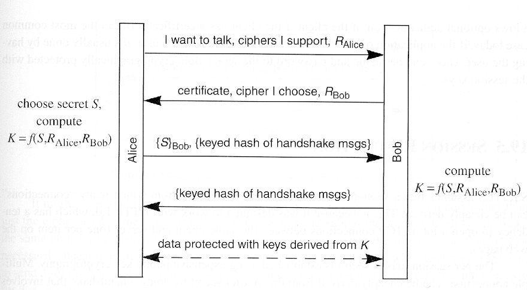

# Dist exam

Tillykke! Du har fundet mine dispositioner. Jeg regner med du bruger dem til at lære noget, og ikke bare kopier. Stave og tastefejlene her i er gratis, og bør ses bort fra.

Er man en ihærdig git bruger, og finder fejl eller ting der ikke giver mening, så opret en pullrequest og fiks det selv. Kan man ikke det, så opret et issue.

## Spørgsmål

* Er min forståelse af Dolev Strong korrekt?
 * Vil med t = 0 ikke bare ske ingenting efter første runde?  

## Ting der skal læses op på

* Safety / liveness propperties

## Dictionary

| Word | Explanation |
|:-:|:-:|
| Byzantine corruption | A party behaves as it wants too |
| Consesus broadcast | All correct parties receive a meesage |
| ⊤ | true |
| ⊥ | false |
| σ | A state |


## 1. Confidentiality (mangler polering)

Så når vi snakker om fortrolighed, har vi nogle forskellige måder at arbejde på: enten med _Secrete Key_, eller _Public Key_ systemer. Uanset hvilken en vi vælger, vil vi aldrig have det således at hvis en fremmed ser en ciphertext _c_ og ikke kender til den anvendte krypterings key _k_, vil den fremme ikke have nogen ide om hvad _c_ repræsentere.


### Unconditional Security: One Time Pad
Unconditionally Secure betyder, at lige meget hvor meget computer kræft man har; kan man ikke lære noget om plaintext af at se ciphertext.

**Kilde for efterfølgende:** [https://www.cryptomuseum.com/manuf/mils/files/mils_otp_proof.pdf](https://www.cryptomuseum.com/manuf/mils/files/mils_otp_proof.pdf)

Ved en _One Time Pad_; hvor det fra navnet er givet, at en key er kun brugt en gang, haves en unbrydelig encryptions algoritme.

Det virker ved en; at en bit streng, bestående af _M1, ..., Mt,_ og en tilfædig bit streng af samme længde _K1, ..., Kt_; hvorfra en ciphertext _C1, ..., Ct_ dannes ved at **XOR** M og K. 

Da det at XOR er en uniform process, kan man fra C og K ligeledes få M.
Det siges at:

Ci ⊕ Ki = (Mi ⊕ Ki) ⊕ Ki = Mi ⊕ (Ki ⊕ Ki) = Mi

| A | B | A ⊕ B |
|:-:|---|:-----:|
| 0 | 0 | 0 |
| 0 | 1 | 1 |
| 1 | 0 | 1 |
| 1 | 1 | 0 |


#### Sikkerhed
Fordi at keyen der skal bruges, er tilfædig og af samme længde som selve beskeden, er det eneste mulige angreb mod en sådan enkryption at forsøge sig med at bruteforce.

Når vi snakker om bruteforce angreb; snakker vi om at forsøge med **alle** keys der vil have været kunne brugt til en besked; altså _2^t_, hvor _t_ er længden af beskeden. Det betyder, at enhver plausibel kombination af en key skal prøves mod cipherteksten; hvor flere keys kan give noget meningsfuldt; men kun den rigtige key vil give M.

Men den fremmede angriber vil ikke vide hvilken key der er rigtig, siden flere vil give mening; og det vil derfor ikke kunne betale sig for angriberen at forsøge sig med et bruteforce; siden alle mulige beskeder er lige mulige betydninger af C.

#### Bevis for sikkerhed

| Notation | Forklaring | 
|---|---|
| Pi | _i_-te bit i plaintext |
| Ci | _i_-te bit i ciphertext |
| Ki | _i_-te bit i key |
| P(Pi) | Sandsynligheden for at Pi var sendt |
| P(Pi &#124; Ci) | Sandsynligheden for Pi gevet Ci |
| P(Ki) | Sandsynligheden for at Ki var brugt til at lave Ci |

En system kan kaldes _perfekt sikkert_ når **P(Pi) = P(Pi | Ci)**; hvilket betyder at cipherteksten er uafhængeig af plainteksten. Altså at sandsyndligheden for at Pi var sendt har intet at sige om Ci var set eller ej.


> **Ligning 1:** `Ci = Pi ⊕ Ki`

Så lad os bevise at One Time Pad opfylder dette!

Fordi _OTP_ keys er total tilfældige og uforudsigelige, kan vi lave to konklusioner:

1. Sandsynligheden for at se en key-bit er lige så høj som at se alle andre
2. At kende en række key-bits fortæller intet om den næste

Grundet første konklusion, kan vi sige:

> **Ligning 2:** `P(Ki = 1) = P(Ki = 0) = 1/2` for alle _i_

Ligeledes kan vi pga XOR, ved at kende 2 af {Pi, Ci, Ki}, kende den sidste.

For at vise `P(Pi) = P(Pi | Ci)`, skal vi først vise at `P(Ci) = P(Ci | Pi)`

##### Distributionen af P(Ci)

Lad os kigge på chanchen for at Ci er 1: 
`P(Ci=1) = P(Ci=1 | Ki=1) P(Ki=1) + P(Ci=1 | Ki=0) P(Ki=0)`

Chancen for `Ci=1` er lig, chancen for `Ci=1` når `Ki=1` ganget chance for `Ki=1` plus chancen for `Ci=1` når `Ki=0` ganget changen for Ki=0.

Pga ligning 1, kan de to muligheder for `Ci=1` være: (Pi=1, Ki=0) og (Pi=0, Ki=1), hvorfor: `P(Ci=1) = P(Pi=0) P(Ki=1) + P(Pi=1) P(Ki=0)`

Gennem _ligning 2_ kender vi P(Ki)

`P(Ci=1) = P(Pi=0) 1/2 + P(Pi=1) 1/2`

Kan omformuleres til:
`P(Ci=1) = 1/2 [P(Pi=0) + P(pi=1)]`

og fordi Pi kun kan være 1 og 0 har vi at

`P(Ci=1) = 1/2`

Det omvendte bevis kan laves for P(Ci=0)

##### Distributionen af P(Ci | Pi)
Lad os nu kigge på `P(Ci | Pi)`

Hvis Pi = 0, kan der ske to ting:

`P(Ci = 0, Pi = 0) = P(Ki = 0) = 1/2` _(ligning 1 efterfulgt af 2)_
`P(Ci = 1, Pi = 0) = P(Ki = 1) = 1/2`

Modsat kan siges om Pi = 1.
`P(Ci = 0, Pi = 1) = P(Ki = 1) = 1/2`
`P(Ci = 1, Pi = 1) = P(Ki = 0) = 1/2`

Vi kan altså sige at distributionen af Ci har intet at gøre med Pi, da **P(Ci) = P(Ci | Pi)**

Chancen for at en Pi og Ci ses, er da:

`P(Pi and Ci) = P(Ci | Pi) P(Pi) = P(Pi | Ci) P(Ci)`

Hvorfor

`P(Ci | Pi) P(Pi) = P(Pi | Ci) P(Ci)`

Vi har vist at `P(Ci | Pi) = P(Ci)`, hvorfor de kan fjernes som konstanter, hvorfor vi tilbage har: **P(Pi) = P(Pi | Ci)**

#### Key længde
Overstående virker kun hvis K er så lang som P, ellers vil nogle key-bits ikke være unikke; og de senere key bits vil bare være kopier af tidligere.

Faktisk gælder det, at antallet af `K ≥ C ≥ M`.
Hvis ikke `C ≥ M` ville flere plaintexts give samme ciphertext; hvorfor man ikke vil kunne decrypte korrekt.

Hvis ikke `K ≥ C`, ville der for en _m_ mangle en _k_ der kunne ENC(m)=C0; hvorved man ved modtagelse af _C0_ kan udelukke _m_.

Alt dette er mod princippet "Perfekt Secrecy", hvorfor det gælder `K ≥ C ≥ M`.

### Computational security, secret-key systems

Hvad vi lige fik beskrevet i detaljer; var et _secret-ket system_, hvor der for kryptering og dekryptering bruges den samme key; der (hvis ønskes sikkert) skal holdes hemmelig. En Secret-key systemer bruges de tre algoritmer: **G**enerate, **E**ncrypt og **D**ecrypt.

#### Sikkerhed i secret-key systemer (Måske kortere?)
I den virkelig verden, bliver vi dog nød til at have den samme key til mange forskellige beskeder; hvorved vi altså må give efter for _unconditionally Security_ og holde os til **computational security**; hvor vi bygger systemer der tager urealistisk lang tid at bryde.

Dette har nogle konsekvenser; blandt andet at hvis vi sender den samme besked to gange; og systemet kun tager besked og key som input; vil to ens ciphertexts blive sendt - hvilket en fremmed vil kunne se.

Derfor tager en god enkryptions algoritme også en tredje og unik variabel som input; kaldet en _nonce_, der skifter fra enkryptions-udførsels til den næste.

Når vi bruger en nonce, markere vi det eksplicit: 

```
c = Ek(m, n)
```

Specielt siger vi for sikkerheden at: hvis en fremmed kigger på en mængde krypteret data, og selvom han (delvist) har haft kontrol over dannelsen af den; så kunne den krypterede data lige så godt være intetsigende for ham. Så lidt må han vide om den.


Når man har et system der bruger samme key til flere krypteringer; er det også vigtigt at angive problemet om _exhaustive search_; hvor hvis en fremmed opdager et hvis antaler ciphertexter og de beskeder de repræsentere; kan han bruteforce sig frem til mulige rigtige keys. Derfor er det vigtigt at bruge en key, minimum af længden 128 bits; da der så vil være 2^128 forskelliger koder - et antal repetioner der anses som for højt til at udregnes af en computer. Dette kender vi som "cost of an attack"; som vi skal tage i lige højde med "probabiility of attack". 

Praktisk talk bruger man to forskellige secrete key systems: block siphers og stream ciphers.

#### Stream Ciphers
En _stream cipher_ er blot en algoritme G der udvider korte keys _k_ og en nonce _n_ til meget længere strenge G(k, n) der _ser_ tilfældige ud; der så er brugt til kryptering som var det en one-time pad: `c = m ⊕ G(k, n)`, hvor vi så dekrypter ved `c ⊕ G(k, n) = m ⊕ G(k, n) ⊕ G(k, n) = m`. Faktisk kan G blot inialieres, og så kan man blive ved man at _streame_ så mange bits man vil fra den; man kan da sige at dens argumenter (k, n) er dens seed.

Eksempler her der kan nævnes:

- RC4
- SALSA20
- SNOW

#### Block Ciphers

En **block cipher** krypter i deres basis form en blok af data af en fikseret længde og outputter en blok i samme længde. 

Eksempler her der kan nævnes:

* DES
* triple-DES
* AES

Når man bruger en Block Cipher, bruger man en så kaldt *Modes of Operation*, som betegner en måde at bruge Block Cipher på til at kryptere end streng af data af vilkårlig længde.

* OFB: Output Feedback
* CBC: Cipher Block Chaining
* CTR: Counter Mode

Disse _modes_ tager ikke blot key'en og beskeden som input, men alle også en nonce; der blot her kaldes en **initialization vector** _IV_.

**Output Feedback** kan bruges til at emulere en _stream cipher_; tag f.eks AES, så gælder blot outputtet: `AESk(IV), AESk(AESk(IV)),...,`, hvorfor netop navnet _output feedback_.

**Cipher Block Chaining** lægger ligesåvel i navnet op til dets funktion; blokke bliver chainet sammet. Givet en besked bestående af 128 bit blocke: M1, ..., Mt, hvor den sidste bliver _padded_ såvidt den ikke er 128 bit lang; så vil ciphertexten være t+1 blokke lang; hvor `C0 = IV` og for `i = 1,..., t:` vil `Ci = AESk(Mi ⊕ Ci-1)`.

**Counter Mode** er lige så, blot ved: `Ci = AESk(IV + i) ⊕ Mi`.

#### Pro/Con ved secrete key

* Pro: hurtigt 10-100 Mbytes/sec ved software, hurtigere ved dedikeret hardware
* Con: key skal være delt før data sendes. Specielt problem hvis flere brugere skal kommunikere og alle have hinanden nøgle.

### Computational Security, public-key systems

I et public-key system, bruges der for hver part, to nøgler: en public og en privat key. Det består ligeså af tre algoritmer: **G**enerate, **E**ncrypt og **D**ecrypt. G tager imod en key-længde og outputter en Pk og Sk; der tydeligvis har en sammenhæng, men som må være meget svær at regne sig frem til.

Alle der har A's Pk kan da kryptere en besked med den, og sende den til A, der så vil bruge Sk til at dekryptere beskeden. Altså: `m = Dsk(Epk(m))`. 

Sikkerheden her er at, selvom en fremmed har adgang til Pk; så vil man ved at have en _c_ ikke kunne dekryptere til _m_.

Det er ved Public-key systemer også vigtigt at kryptering indeholder noget tilfældigt; da en fremmed vil kunne modtage en _c_ og blot selv prøve at kryptere en _c'_ indtil `c = c'`; hvorfor han ved hvad _c_ er - hvilken han ikke må.

Ligeså er Public Key systemer også modtagelige over for exhaustive search ved søgning efter _sk_; og eftersom der findes algoritme der er "hurtige" til at regne _sk_ fra _pk_, bruges der normal meget større keys i publik-key systemer.

#### RSA
I RSA består pk af to numre: _n_ og _e_, og sk består af _n_ og _d_. Nummeret _n_ kaldes for modulet, og består af produktet af to prim nummere _p_ og _q_. Numrene _e_ og _d_ er valgt til at tilfredstille en relation.

Kryptering under RSA består simpelt af: `c = m^e % n`.
Dekryptering under RSA består da af: `m = c^d mod n`.

Forholdet her gælder da at: `c^d mod n = (m^e mod n)^d mod n = m`.

Den egenlige trussel mod dette, er at "factoring" _n_; som er hårdere des højere _n_ er. Derfor er keys i RSA i dag 2000-3000 bits lange.

##### OAEP
Hvis en fremmed kan "eksperimentere" med dekrypteringsalgoritmen og derved se hvordan den reagere; kan det muligvis afsløre detaljer om secret keyen. 

Derfor bruger man OAEP der "padder" OAEP(m, R) hvor R er random.

Dette kunne f.eks bruges til at bruge RSA+OAEP til at sende nøgler rund til et secret key system. Så først opsæt en public-key system; for derefter at udnytte det til at køre en hurtigere secret-key system.

## 2. Authentication (mangler polering)

Når vi snakker om authentication; er det ideen om, at vi skal kunne bekræfte - at den person der forsøger at fuldføre en handling - ligeså skal have tilladelse til at udføre den handling.

### Unconditional security, the table-based solution

Hvis vi siger, der er en endelig mængde af beskeder; så kunne sender og modtager på forhånd aftale en tabel der matcher alle beskeder med en tilfældig udvalgt t-bit lang MAC uafhængeig fra beskeden. Tabellen fungere nu som en key; hvor man sender beskeden og den tilhørende MAC frem og tilbage. Derfor står det klart, at en fremmed ikke kan gætte sig frem til en MAC for en besked han ikke har set (eller jo - chancen er bare 2^-t). Vigtigt er det her at sige, at en MAC ikke kan genbruges.


### Computational security, secret-key

Overstående var et eksempel på et Secret key system i authentication; hvor vi ikke ønsker at andre skal kende til vores hemmelig key. Jeg nævnte at der bliver brugt en MAC; som er en af tre algoritmer der bruges under et secret key system i authentication.

MAC står for **Message Authentucation Code**, og beskriver fint sig selv. Derudover findes algoritmen G der genere keys, og algoritmen V der bruges til at verificere nøgler.

* G(l) outputter key af længden l
* MACk(m) outter MACen _c_ for _m_ under keyen _k_
* Vk(m, c) verificere om _c_ og _m_ hører sammen under keyen _k_

Som sikkerhed for brug af MACs, siges det at hvis en fremmed ser et antal MACs og de beskeder de repræsentere; vil det uanset antallet ikke være muligt for den fremmede selv at lave en MAC baseret på en besked der ikke er sendt før. For at undgå en fremmed bruger **exhaustive search** til at gennemskue en key; kræves det for moderne computere at de har en længde af minimum 128 bits.

#### Eksempel: CBC-MAC
Også kaldet Cipher Block Chaining Mac.

Er en MAC algoritme, der virker som CBC med IV = 0. Outputtet er da outputtet fra den sidste block.

**Cipher Block Chaining** lægger i navnet op til dets funktion; blokke bliver chainet sammet. Givet en besked bestående af 128 bit blocke: M1, ..., Mt, hvor den sidste bliver _padded_ såvidt den ikke er 128 bit lang; så vil ciphertexten være t+1 blokke lang; hvor `C0 = IV` og for `i = 1,..., t:` vil `Ci = AESk(Mi ⊕ Ci-1)`.


### Computational Security, public-key signatures

Når vi snakker public-key authentication systemer; bruges der ligesåvel tre algoritmer:

* **G** outputter et key-pair sk _(signing key)_ og pk _(verification key)_, med en speciel relation
* **S** bruges til at signe en besked. `c = Ssk(m)` (hvor man så sender m, c)
* **V** bruges til at verificere en nesked. `bool = Vpk(m, c)`.

Sikkerhedenfundamentet her, ligner meget hvad der var i secret-key systemet; en fremmed må se alle de beskeder og signature han vil; men uanset antal må ikke være i stand til selv at producere en valid signatur til en uset besked.

Man bruger en stor key; da der findes algoritmer til at finde Sk fra Pk.

#### Forskel mellem secret og public key authentication systemer

Når man bruger en MAC, kan B ved modtagelse af _m_ fra A; se om den virkelig var fra A (givet at kun A og B kender MAC); men B kan ikke bevise for nogle andre at det var A der sende beskeden, den kunne ligeså godt have været generet af B.

Her er formålet ved at bruge public key systemet; for alle kan have A's pk; men da kun A har SKa; er det kun A der kan signere en besked _m_. Så sender A en signeret besked til B, kan C der har SKa verificere at A lavede _m_ og ikke B, selvom det er B som nu er i besidelse af den.

#### Basis RSA signature er usikre

Basere man signature på RSA, vil S og V virke som følgende:

* Ssk(m) = s = `m^d % n`
* Vpk(m, s) = m' = `s^e % n`; tjek `m' == m`

Men et problem kommer på tale her: Hvis en fremmed blot vælger en _s_ og kører V derpå; vil han få en _m_. Nu kan den fremmede blot sige, at _s_ er en signatur for _m_. Det er ikke sikkert at _m_ betyder noget i det store hele; men det er en mulighed.

### Hashfunctions

Hashfunktioner kan løse førnævnte problem ved brug af RSA til secret key signatur.

En hashfunktion _h_, skal have følgende egenskaber:

* Tage imod en besked uanset længde
* Producere ouput af en fikseret længde
* Skal kunne regne lige så hurtigt som de beste secret key systemer.
* Skal være et svært beregningsmæssigt problem til at producere en _kollision_. Altså skal en _x_ og _y_ være svær at følgende der efterlever hvor `x != y` men `h(x) = h(y)`.

Sidsnævnte kan doig bruteforces, men hvis længden af _h_ er k-bits, vil det tage `2^k/2` forsøge.

Af hash-funktioner kan blandt andet nævnes:

* MD5, som aldrig bør bruges, da den er total brudt
* SHA-1, er tildels brudt
* SHA-256

### Combining RSA and hash and why it solves the problems.

Ved at bruge RSA med hashing, til at lave et signatur system - kan man ikke bare gøre det hurtigere (da hashen typisk er kortere) men også forhindre førnævnte angreb.

* S2sk(m) = s = `Ssk(h(m))`
* V2pk(m, s) = h `Vpk(h(m), s)`

Fordi at man skal sende `(m, s)` og den fremmede frit kan en _s_, men da _s_ afhænger af en hashet udgave af en _m_, skal den fremmede du fra _s_ lave en _m_ der ved `S2(m) == s`. Dette er nærmest umuligt; da det for en hashfunktion der er svær at finde kollisioner for; også er svær at invertere.

Derfor forbedre hashing sikkerheden for RSA.

### Replay attack
At bruge signature beviser bare, at vi på _et tidspunkt_ godkendte en besked; men en fremmed kna i teorien kapre beskeden og signaturen og sende den igen og igen. Dette hedder et replay attack og kunne f.eks bruges mod en bank.

Der er flere måder at forhindre dem på

* Man kan huske på hver besked; men det er dumt
* Man kunne bruge counters, men det kræver der bliver husket på dem; og sæt nu en besked bliver tabt? og man venter på _n_ men modtager _n+1_?
* Man kunne bruge timestamp; men det kræver igen at man husker på et stadie; og hvornår er en besked for gammel? hvad hvis forbindelse bare var langsom? Det kræver desuden også en synkronisering.

En ordenlig metode er, at en modtager vælger et _nonce_ og sender til senderen. Dertil sender senderen sin besked plus en MAC udregnet over det nonce og beskeden. Det forhindre replays, da nonces kun bliver brugt en gang.

## 3. Key Management and infrastructure (mangler finpudsning)

En ting er hvordan man bruger keys til og hvad de kan bruges til; som kurset har arbejdet meget med - men det virker kun ved at flere forskellige parter dele deres keys; det er det problem som key management handler om.

### Session keys

> Et hvert sikkert system løber konstant risikoen om at blive eksponeret; des længere det ikke fornyer sig og stadig benyttes.
 
Derfor at det, at kommunikation mellem A og B som primært vil foregå ved hjælp af **session keys**, altså at deres keys vil blive udskiftet som tiden går. 

Dettte sker typisk ved, at A og B på forhånd har agreet på en **long term key _Kab_**; de bruger til at sende nye session keys frem og tilbage.

Det virker ved, at hvis A vil sende M, sender A: `
E_Kab(Ks), Eks(m)`; hvorfra B kan bruge _Kab_ til at skaffe den nye _Ks_ så B kan skaffe _m_.

Dette virker dog bedst des mindre antal der skal kommunikere sammen; hvorfor der ved større kommunikationsanlæg bruges Key Distribution Centers og eller Certification Authorities.

### Key Distribution Centers

Key Distrution Centers virker udelukkende på secret-key teknologi.

Ideen er, at der er en KDC og mange brugere heraf. Hver bruger deler en key _Ka_ med kdc'en.

Når A vil kommunikere med B, laver KDC'en en session-key som den sender til A: E_Ka(Ks) og til B: E_Kb(Ks) - så A og B nu kan kommunikere.

Dette forhindre, at alle skal have keys til at snakke med alle andre som før; og det kun er KDC'en som kender til alle keys.

KDC'en bringer dog også nogle problemer:

* Hvis KDC'en bryder ned, kan ingen snakke sammen
* A kan ved modtagelse af Ks ikke vide om forbindelsen til B er sikker og ej heller om B er aktiv.
* Det kræver alle stoler på KDC'en, da den har den ultimative mulighed for at afkode alle beskeder, eftersom det er den som genere nøglerne.

### Certification authorities

Hvor KDC'er bruger Secret Keys, bruger Certification Authorities Public Key systemer.

CA'en starter med at genere sit egen key-pair (SKca, PKca); og det bestemmes at alle brugere af CA'en ligeså vil have dens public-key.

En bruger A vil så skulle registre sig ved CA'en ved en ukrypteret metode; da CA intet ved om A - f.eks ved at møde op personligt. A giver da CA PKa; og hvis accepteret får A et cerfitikat, bestående af (IDa, PKa, S_SKca(IDa, PKa)) - altså en kvitering. Fordi alle bør have PKca, kan alle nu tjekke en sådan kvittering; og  deler man sit certifikat kan en anden tjekke at det gælder, og senere bekræfte beskeder via PKa.

Sikkerheden ved at bruge en CA, ligger i - at vi alle stoler på den ikke uddeler certifikater på flaske grundlag - og at CA'en aldrig ser en anden PK; hvorfor CA'en nu ikke kan fuske med beskeder.


- Who has which keys and what happens when a certificate is issued
- How is a certificate used

### Certificate chains

I den virkelig verden er der dog mere end en CA, og man kan komme ud i en situation hvor man får et certifikat fra en CA man endnu ikke stoler på.

Hvis et certificat fra en CA1 betegnes: CERTca1(A, PKa), så kan ca bekræftes:

1. A har et certificat fra CA1 og B har et fra CA2.
2. A modtager CERTca2(B, PKb) hvilket han ikke kan bekræfte da han ikke kender CA2.
3. A modtager CERTca1(CA2, PKca2)
4. A kan nu bekræfte CA2 og derved bekræfte B

Det kaldes en kæde ved: CERTca2(B, PKb), CERTca1(CA2, PKca2).... da det jo vil kunne fortsætte længe.

Dette giver en observation: Hvordan stoler vi på den første CA/KDC? Som før nævnt, må de (ofte) ske fysisk.

### How to identify users

Men hvordan kan vi så genkender en bruger. Bogen stiller tre metoder op: via kodeord, via hardware eller via biometrics.

#### Passwords: issues/attacks when a password is:

Anses som det svageste af alle tre metoder, da et kodeord netop skal huskes af et menneske; og for at et menneske kan dette; vælger det ofte _nemme_ koder; eller de skriver dem ned - begge dele der sænker sikkerheden.

Der er nogle vigtige aspekter omkring password:

* De skal være stærke; en fremmed skal ikke kunne gætte det. F.eks at basere det på anden personlig information anses som en dum ide. En kode skal kunne bestå af et sæt af tegn af størrelsen C og have en længde L, så vil der være C^L forskellige kodeord. Hvilket vokser hurtigere af L end af C. Studier viser brugere normalt kan huske 12 tegn som maks. En bruger kan også vælge at have en passphrase istedet, der anses for at være nemmere at huske. Der er også folk der aflurer koder på andre måder, kamera, fake pengemaskiner osv. 
* Når brugeren anvender sin kode, og den sendes over netværket, skal den sendes sikkert - så en fremmed ikke kan opsnappe den og udnytte den.
* Brugeren skal så vidt muligt gemme koden på en forsvarlig måde, så en fremmed ikke kan finde koden. Brugeren skal være klar over _social engineering_ der prøver at franare koder fra folk.
* Servicen der skal verificere koden; skal have den gemt forsvarligt - her betegnes f.eks vigtigheden i aldrig at gemme selve koden; men en krypteret udgave af den ved en one-way function.

Nogle ting man kan gøre for sine brugers sikkerhed:

* Lær brugerne at vælge svære kodeord
* Sløv en angriber ned, f.eks ved at bruge en lang encryptions metode
* På serversiden; så hav en del der krypter kode og en del der godkender; så en fremmed ikke pludselig får adgang til begge.

Password managers?

#### Hardware:

Man kan f.eks bruge en USB-nøgle der har forhøjet fysisk sikkerhed, til at godkende sig selv med.

Hardware der er svær eller tidskrævende at bryde ind i, kaldes: **Tamper Evident**. Her kan vores chip-dankorts f.eks nævnes; der i sig selv er små sikre computere.

Der findes også langt sikre hardware; der betegnes **Tamper Resident**. Det bliver f.eks brugt af CA og banker.

Tamper Evident Hardware bruges ofte til **Two Factor Autentication**. Ideen er at godkende en bruger i to stadier; først via password og så at han har den rigtige hardware.

> Der er en SK i hardwaren og samme SK er i verifyeren.
> Verifieren sender så en nonce.
> Hardwaren returnere så R(sk, c)
> Som verifieren så tjekker

#### Biometrics: what is it, what can it be used for

Der kan bruges fingeraftryk, ansigtscanning, øjescanning, stemme, osv...  Alle virker ved at blive omdannet til noget digitalt data, som så bliver matlchet med en entry i en database.

Det store problem her; er at systemet skal have en hvis buffer i forhold til at vi som levende organismer konstant er i forandring; men samtidig aldrig lade en fremmed komme ind der forsøger at udgive sig for os.

Pro:

* Vi skal ikke huske en kode

Con:

* Vi er ikke anonyme længere

## 4. Network Security Mechanisms

Så det vi kender som Internettet, er i bund og grund et meget usikkert sted; og man kan "nemt" som en fremmed se hvad der sendes frem og tilbage; nogle gange vil det dertil også være muligt at ændre på det.

Det kan løses ved at kommunikere igennem "sikre tunneler" over internettet; som jeg gerne vil snakke om; og hvordan de bruges og laves.

### Definition of AKE
AKE står for Authenticated Key Exchange, og sørger altså for at vi har kan stole på den tunnel af kommunikation vi sætter op.

Det sker ved at en A og B har certifikaterne der indeholder _pkA_ og _pkB_; og nu vil bruge disse til en udveksle en session key _k_. Fordelen her er at _k_ er shortlived og kan smides væk når samtalen er ovre; og ligeledes at _k_ bygger på Secret Key og derfor er langt hurtigere.

Helt konkret er AKE en protokol for to parter; hvorden den bliver startet med intentionen om at etablere en key med den anden part. Ved anden af protokollen skal hver part godkende og outputte keyen.

Protokollen har nogle betingelser:

* **Agreement** Hvis A vil snakke med B og omvendt; samt de begge acceptere og outputter en key - vil de keys være ens.
* **Secrecy and Authentication** Hvis A vil snakke med B og A acceptere; så deltog B; og hvis B accepterede ville B og snakke med A. Ligeledes kender en fremmed hverken keyen fra A eller B.
* **Freshness** Hvis der udstedes en nøgle, skal den være ny

### Needham / Schroeder and the attack

Needham and Schroeder præsenterede engang en protokol der virkede ved:

* A krypter (IDa, nonceA) under PKb og sender til B
* B dekrypter, tjekker id og sender (nA, nB) tilbage kryptere under SKa
* A dekrypter og tjekker nA er rigtig og sender krypteret nB tilbage
* B godkender nB
* Begge laver en key fra nA og nB

Men denne protokol, viste sig ikke at være rigtig.

Hvis vi forestiller os; at en tredje part E var blevet banlyst af B, og A forsøgte at skabe forbindelse med E - kunne E blot sende denne information videre til B (der ville tro den kommunikere med A), og derved bruge A til at opnå en secret key forbindelse mellem E og B, alt imens B tror den snakker med A.

### SSL / TLS and the SSL handshake

En protokol der virker, og som ofte bruges er SSL (Secure Socket Layer Protocol.) - i dag er det dog TLS, men den bliver bare kaldt SSL også.

SSL bruger flere forskellige protokoller for at virke, men den der står for Authenticated Key Exchange hedder "Handshake Protocol". Den virker ved at clienten sender en liste af kryptoalgoritmer ranked som den gerne vil bruge; serveren svarer så hvilken en de skal bruge. Så sker key-exhange. 

SSL virker i grove træk ved:

* Client siger den vil connecte, sender encryption metoder den kender og et nonce
* Server sender certificat, valgt encryption og et nonce
* Clienten verificer; sender PMS (pre master secrete - random) encrypteret under PKs, samt Certificat og signerings af E(pms)+nonceA+nonceB
* Server godkender Certificat og afkoder PMS.
* Server sender MAC af historik med PMS som secret key
* Client godkender og sender dens MAC af historik med PMS som secret key.
* Nu laver client og server keys fra de to nonce og PMS



Serveren beviser altså den var i stand til at dekrypte med SKs og få PMS ved at sende en MAC af historikken. Og clienten beviser den var i stand til at signere enkryptionen af PMS og senere sende MAC af sin historik.

Ved at MAC deres respektive views af samtalen, kan de bevise at de havde den samme samtale, og at intet var ændret.

Dette tvinger en fremmed til kun at kunne forwarde beskeder, og ikke ændre dem.

I bund og grund virker SSL mellem en Server og en Client; men kan være et-vejs i det kun at serveren har et certfikat. Dette er typisk for hjemmesider og vil blive diskuteret senere. Men sikkerheden ligger i signatur + kryptering af deres beviser om historikken.

### Diffie-Hellman (authenticated) key exchange and IPSec

IPSec er en række af protokoller der gør nogenlunde det samme som SSL gær; men det sker på et lavere niveau; nemlig nede i transport laget. Det vil sige, at selve forbindelsen mellem to IP'er vil blive sikker. Alt dataen derimod fra samme IP går igennem samme tunnel. IPSec bruger Internet Key Exchange, som også er public-key authenticated, bare via Diffie Hellman Key Exchange.

Forstiller vi os at det følgende repræsentere Diffie Hellman, og at det blot ligeså er authenticated med public-key; så vil jeg gerne forklare det ved hjælp af farver; hvordan de bliver enige om en key.
 
 * De starter med en fælles engangsfarve Z
 * vælger hver i sær en hemmelig farve (X og Y) som de blander i. 
 * Sender blandingen til hinanden public
 * Den blanding de får tilsendt tilsætter de nu deres egen private farve i (X og y)
 * De har nu begge X + Y + Z.

### Difference between SSL and IPSec

Det er forskelligt hvornår man bruger hvad; og det kommer an på sitautionen. Men fordi IPSec via på transport lageret; så lige så snart det kommer til netværks-adapteren, så er forbindelsen ikke sikker mere; så det kræver man stoler på sin egen hardwareæ - derimod så kan alle applikationer på computeren nu bruge den tunnel.

For SSL er man beskyttet helt op til applikations laget; hvilket betyder man er imun fra spyware osv.

### Password authenticated key exchange

Som jeg nævnte før ved SSL, kan vi have det som one-way; hvor det kun er Serveren der har et certificat - og at det faktisk er det der oftest sker med hjemmesider etc. Derfor bliver man på mange hjemmesider nød til at angive sig selv med en bruger og et password.

Men hvad er problemet så? Fordi at passwordet ikke er en central del af protokollen; mener nogle at sikkerheden derfor kun er baseret på passwordet - hvorfor de ligeså mener man bør designe en protokol omkring passwordet.

Men at have en kryptering der kun er baseret på et long-term password, er usikkert; da en fremmed kan opsnappe noget ciphertekst og bruteforce koden offline - for derefter at bruge koden online.

Password Authenticated Key Exchange virker nogenlunde ligesom Deffie; men bruger ens password til at kryptere kommunikationen - så man i sidste ende kan blive enige om en ny key som man fremadrettet bruger.

>### Applications, document based secure formats versus secure tunnels
> Hvad? Forstår ikke hvad de mener med dette punkt

## 5. System Security Mechanisms

Når vi snakker om metoder for system sikkerhed; så mener vi, at vi ønsker at beskytte mod at eksterne angribere komer ind i systemet og ligeledes angreb fra partier der allerede er inde i systemet. Altså vil vi kun give adgang til systemet, for de parter der overholder vores _sikkerheds politik_. Når jeg siger adgang her, mener jeg ikke nødvendigvis fysisk adgang, men lige så vel digital adgang.

### Trusted computing base

Vi skal bruge en del af computeren, til at bestemme hvem der skal have adgang til hvad, og sørger for at dette bliver overholdet. Det skal være en sikker del; der gør at den ikke kan ændres udefra og at dens beslutninger er endelige. En sådan del kaldes for en Trusted Computing Base og er ofte en del af et operativ systems kernel.

Et eksempel på en TCB er **Intels SGX**; som er at finde i mange af Intels nyere CPU'er. Det er en hardware beskyttet del af chippen, som kan udføre en lang række operationer og holde små mængder af data. Dette kaldes også for en **Secure Enclave**. Sådan en er designet til at man ikke kan tilgå den data udefra eller at ændre dens opførsel; selv ikke engang fra ejeren af maskinen. En Secure Enclave kan bruges til kun at køre software med bestemte signature, holde private keys og signature, og derved køre et program og signere outputtet. Hvorfor andre ved at programmet blev udført korrekt.

Et andet eksempel på en Secure Enclave, er den som sidder i Apples A-chips serie; der blandt andet står for at godkende operationer baseret på ens biometriske aftryk mm. Denne chip har været omtalt en del i medierne, da den har været omdrejningspunkt i flere terror sager i USA; hvor efterforskningstjenester ikke har kunnet få adgang til vigtig data pga chippen; som ej heller Apple selv vil kunne udtrække.

### Firewalls
Okay så store dele af bogen handler om hvordan vi opnår sikker kommunikation; men for at kan gøre det, kræver det at vi starter i usikker kommunikation; og dette kan udnyttes til at angribe os. Herfra kommer ideen om **Firewalls**: en person kan ikke bryde ind i en computer han ikke kan snakke med. Kort sagt sørger en firewall for at stoppe dele af trafik på et netværk, altså at den stopper kommunikation til computere der ikke ønsker kommunikation udefra.

Vi husker på, at kommunikationen over internettet består af forskellige pakker. Det simpleste type Firewall, bruges **Packet Filtering**, som simpelt kigger på disse pakker; og bestemmer om de skal komme igennem eller ej. Det kunne f.eks være at stoppe alle pakker der prøve at åbne en ny TCP forbindelse. Men packet filtering er ofte meget sort eller hvidt; og er ikke nødendigvis hvad man ønsker; vi vil gerne have noget der analyser de forskellige packets bedre og mere intelligent.
Pro: simpel
Con: sort/hvid

Det er her **Proxy Firewalls** kommer ind i billedet. Der simpelt vil overtage en forbindelse på vegne af maskinen. Altså vil en client forbinde til en firewall, der så forbinder til den eksterne server. Udefra vil det altså kun se ud som om, at det er firewallen som netværket består af. Det kan ses som at bruge et skjold om hele sit netværk - og firewallen skal hackes igennem før computerne på netværket kan blive ramt. Det er dog ikke særlig fleksibelt igen, da det kræver at softwaren er skrevet til at bruge firewallen som mellemmand.
Pro: skjold for mange
Con: software skal skrives dertil

En **Statefull Firewall** holder styr på alle forskellige connections; og holder lige så styr på om der er tilladelse til at lave nye. Firewallen kigger på pakker; og hører de ikke til en connection bliver de afvist. Dette kræver at firewallen har styr på hvilke connections der er aktive - hvorfor det er at den hedder _Statefull_. Den tillader også, at man maskere de interne adresser udadtil; hvorfor det også kaldes en _masquerading firewall_. Sidst men ikke mindst kan firewallen overvåge en forbindelse, og i tilfælde af der sker noget mistænkeligt: lukke den ned.

### Malware and defenses

I tilfældet af, at en angriber kommer forbi en firewall og får adgang til vores maskiner; kan det være at der bliver installeret ondsindet software på vores computere. Det kommer i mange variationer: trojanske heste, viruser, orme og ransomeware. Vi vil gerne undslippe at dette sker, men i tilfældet af at det sker - hvad gør vi så?

Det er dette som **Virus Skannere** gør. Det holder øje med filerne på computeren for at kigge efter dele af kode der kendes som skadelig eller andre kendetegn, fra en stor database som konstant opdateres. På det seneste har skadelig software dog forsøgt at forhindre dette ved at kryptere sig selv.

En anden måde end at overvåge filsystemet for skadelige dele; og også at overvåge hvad der aktivt sker på en computer. Dette hedder **Intrusion Detection**. Dette minder meget om hvad **Statefull Firewall** også gjorde mulig; nemlig at se på data-flowet; og sker der noget man mener er mistænkeligt, kan man tage aktion.

Der er to måder at bestemme på, om der foregår noget der ikke må: ud fra **Regler** og ud fra **Statistik**. Reglerne betegner en række prebestemte måder der definere normal opførsel; brydes de så skrides der til handling. Ellers så kan man statistisk kigge på hvad der er god opførsel; og begynder man at se noget der ikke stemmer overens, træde til handling.

En sidste måde, kaldet "Honey-pot" måden; minder på mange måder om en mussefælde. Altså at lokke til at angribe en fil, og i tilfælde til træde til handling.

### Security Policies

Der findes modeller for sikkerhesd politikker, og der findes implementeringer af modeller som netop kaldes sikkerhedspolitikker. Det førstnævnte er altså en genereal betegnelse for det første.

En sikkerhedspolitik, betegnes som:

> En specifikation af det pågældende system, en beskrivelse af de sikkerheds foranstaltninger der ønskes for systemet, og muligvis en high-level strategi for hvordan de skal opnåes.

Kort sagt, beskriver en sikkerheds politik: Systemet, den ønskede sikkerhed - og hvordan den skal opnåes. Politikken kunne f.eks beskrive hvem der kan gør hvad og hvem der ikke må gøre hvad, eller hvilke situationer som systemet skal tollere.

Til at hjælpe med at angive præcise beskrivelser af en sikkerheds politik; kan vi bruge det der kaldes en **Lattice**. En lattice består af en endeligt set _S_ og en relation _≤_. Elementerne i _S_ betegner forskellige rettighedsroller; og selve ideen ved latticen er at beskrive forholdet imellem rettigheder.

For elementerne _a, b, c, ∈ S_ gælder det at:

* a ≤ b, b har mindst lige så mange rettigheder som a
* a ≤ b and b ≤ a betyder a = b
* a ≤ b and b ≤ c betyder a ≤ c

Det er ikke nødvendigvis alle rettigheder i _S_ der kan sammenlignes; hvorfor alle ikke skal sammenlignes.

Nogle ekstra ting skal være opfyldt for _S, ≤_ kan være en lattice:

* Der skal eksistere en største mindste værdi
* Der skal være en laveste øvre værdi

Vi bruger en lattice ved at skrive:

* Et subject _s_ med klasseficering _C(s)_ må udføre en operation på object _o_ med klassificering _C(o)_ hvis og kun hvis _C(o) ≤ C(s)_.
* Information må flyde fra _a_ til _b_ hvis _b ≤ a_.

Den første forsøg på at formaliser en sikkerhedsmodel, var Bell-Lapadula modellen; der af militæret blev brugt til at betegne hvordan information skulle flyde; nemlig opad i herakiet:

* **No read up** Subjekt _s_ må læse fra objekt _o_ hvis kun _C(o) ≤ C(s)_
* **No write up** Subject _s_ må skrive til objeckt _o_ hvis kun _C(s) ≤ C(o)_.

En anden: Biba modellen, virker omvendt - i det den betegner at vigtig information kommer ovenfra og skal flyde ned af.
 
### Other models, Chinese wall, Dual control etc.

Der findes dog mange af disse slags modeller, her benævnes et par stykker:

* **Chinese wall*: Et firma har flere forskellige klienter; nogle der tilmed er i konkurrence med hinanden. Protokollen garanter da, at en ansat i firmaet ikke kan afsløre information og en klient til en anden klient; hvis de er konkurrenter. Reglen er så, at den ansatte kun kan få information om en klient, hvis han aldrig har fået information om en af klientens konkurrenter.
* **Dual Control**: Er en model, hvor en handling kun er tilladt hvis flere autoriserede parter har givet tilladelse.

### Access Control

Det kan være svært at vide hvornår forskellige subjekter må gøre hvad til hvilke objekter. Det er her en access control matrix kommer ind i spillet. Betegnes ved en matrice A med en række for hver subjekt _s_ og en kollone for hvert objekt _o_, så betegner A[s, o] en liste af alle operationer _s_ må udføre på _o_. Det er dog omfangsrigt at have sådan en matrice, så i praktis bruges andre metoder:

* **Access Control Lists**: For hvert objekt gemmer vi hvem der har rettigheder til det. Det gør det nemt at se hvem der har adgang, men svært at se til hvilke operationer. Det er således UNIX virker, dog ved at gruppere hvem der har adgang i "bruger", "brugerens gruppe", og "alle andre".
* **User Capabilities**: For hvert subject gemmes mulighederne. Det gør det nemt at vide hvad en bruger må gøre; men ikke på hvad. Windows bruger denne.

## 6. Threats and Pitfalls

Godt. Så når vi snakker IT-systemer skal vi altid tænke på sikkerhed. Vi har derfor en **Thread Model**, der fortæller hvilke trussler og i hvilken grad vi forventer dem og hvor meget vi vil beskytte os mod dem.

Der findes flere forskellige typer af angreb, så der er meget at tænke over når man udviklser sine systemer. 

### Taxonomy of attacks and goals

#### Hvordan der angribes
Der er flere måder at kategoriser et angreb på. X.800 standarten klasificer angreb som to typer over en netværks transmission: Passive og Active angreb.

Af pasive angreb kan nævnes:

* **Eavesdropping**: lytter og kigger på sendt
* **Traffic analysis**: Hvem sender til hvem, og hvor meget?

Af aktive angreb kan nævnes:

* **Replay**: send en gammel besked igen
* **Blocking**: forhindre en besked i at komme frem
* **Modification**: ændre eller injekter data i sendt besked

Det er klart at pasive angreb er svære at opdage; den første kan dog stoppes ved at bruge kryptering. Aktive angreb er nemmere at opdage, men sværere at forhindre.

#### Hvorfor der angribes

Forskellige angreb kan have forskellige mål. STRIDE betegner de forskellige mål angreb typer og deres mål, og er en forkortelse for: 

* **Spoofing Identity**: opnå mulighed for at imitere en bruger
* **Tempering**: ændre på data uden det opdages
* **Repudiation**: gøre noget; uden at det kan bevises
* **Information Disclosure**: se fortroligt data
* **Denial of service**: DDOS
* **Elevation of privilege**: give sig selv flere rettigheder

Det skal dog nævnes, at et angreb sagtens kan høre under flere af disse betegnelser. En man-in-the-middle angreb vil ofte f.eks både btegnes som "Spoofing Identity" og "Information Disclosure"

#### Hvor der angrebes og af hvem
En helt tredje måde at betegne et angreb på, er via EINOO. De to første betegner hvem:

* **E**xternal attackers
* **I**nternaæ attackers

Hvor der bliver angrebet:

* **N**etwork attacks
* **O**ffline attacks
* **O**nline attacks

#### Hvorfor var det muligt
En sidste måde at kategorier angreb på er via TPM, som betegner hvorfor det var muligt:

* **T**hread model: vi forudså ikke dette angreb
* **P**olicy: vores sikkerheds politik var ikke god nok
* **M**echanism: vores mekanismer var ikke tilstrækelige.

### Illegal input attacks

Så lad os starte med at kigge på nogle angreb! Mange IT systemer tager input fra brugeren; og hvis disse inputs ikke håndteres korrekt - kan de udnyttes til at udføre angreb.

#### Overflow

Forstil vi får et input der er længere end forventet. I sprog som C kan dette være en problem. Forsøges et input at gemmes i et array der ikke er langt nok; vil det overskydende overskrive hukommelsen uden for arrayet. Dette kan f.eks få programmet til at crashe - men kan en angriber selv bestemme input; kan angriberen ligge farlig data i hukommelsen.

Det kunne f.eks være; at det var muligt i et program at overskrive en stacks _return address_ og dermed bestemme med input data; hvor computeren skal køre efter en funktion er udført. Hvilket kan være yderst farligt.

Aktivt angreb: modification
Stride: Kan være alle mulige grunde, alt efter hvad man udfører

#### Cross-site scripting

Et angreb jeg selv måtte lære om på den hårde måde; for 10 år siden da jeg begyndte at lege med webprogrammring; var cross-site scripting. Noget moderne browsere i dag, heldigvis hjælper med at forhindre.

Hvis en hjemmeside kan tage imod bruger-input, og på en anden side udskriver selv samme input; så kan et sådant input indeholde javascript-kode, som browseren vil køre. 

Dette bliver først rigtig farligt; når en ond hjemmeside vælger at sende brugeren hen til den anden naive hjememside der udskriver inputtet. Fra brugerens og browserens synpunkt; ser det ud som at javascriptet kommer fra den naive side hvorfor javascripten pludselig har adgang til den naive hjemmesides data. Det kan javascripten nu sende videre; helt uden at man opdager noget.

Aktivt angreb: Modification
Stride: Spoofing Identity, Tempering, Repudiation og Information Disclosure
EINOO: ekstern, online


#### Heart bleed
Heart Bleed var en bug der var i OpenSSL. Man udnyttede at man i SSL bruger et heartbeat, til at tjekke at en server stadig er i live. Dette gøres ved at sende et nonce og dets længde. Serveren vil så gemme dette nonce i et array; og udskrive fra array så langt som længden der blev sendt - og sende det samme tilbage. I hele to år, glemte man at tjekke om længden der blev sendt rent faktisk matchede; og derved kunne man sende en længde der var længere end selve noncet; og derved få serveren til at sende noget af dens interne memory tilbage.

Stride: Information Disclosure
EINOO: external, online/network

### SPECTRE - full detail

Kilde: [https://www.youtube.com/watch?v=q3-xCvzBjGs](https://www.youtube.com/watch?v=q3-xCvzBjGs)

Moderne CPU ramte et loft da de kom op omkring 4Ghz, og producenter måtte finde andre måder at forhøje hastighederne på. Dette ledte til at _speculative execution_ blev opfundet; hvor at en CPU vil prøve at gætte hvad den skal i udføre i fremtiden; hvis den lige pludselig får mulighed for at udføre noget imens den venter på noget andet.

At en CPU skal vente, kunne f.eks være at den skulle bruge noget data som den ikke havde i dens egen cache men først måtte hente fra RAM. Når noget bliver hentet fra RAM, bliver det lagt ind i cachen som er langt hurtigere, som CPU'en så bare internt bruger. 

Det vil sige, hvis en CPU gætter rigtigt om hvad den skal udføre i fremtiden, og den allerede har udført disse og lagt deres resultater i sin cache, er disse resultater hurtigt tilgængelig - så cpu'en hurtigt kan arbejde videre uden at skulle vente yderligere på at information bliver sendt fra rammen.

Fejlen som SPECTRE handler om; finder sig i; at disse spekulative operationer ikke får slettet deres resultater fra cachen; og man må den måde kan udnytte _speculative thinking_ til at få fat i information, man ellers ikke vil kunne tilgå.

Dette kunne for eksemepel ske ved et multi-user system på en computer, eller ved noget så simpelt som to taps i en browser.

```
data = [1, 2, 3, 4] // et vilkårligt set af information

input = 1000 // Et tal større end data.size

if (input < data.size) {
	secret = data[input]
}
```

I overstående eksempel, kender CPU'en ikke værdien af data.size, så den vil spørge RAM om dette - hvilket tager tid. Derfor vil `secret` nu komme til at indeholde `data[1000]` - såfremt den tror `if` vil blive sand (kunne være angribern havde kørt det mange gange, hvor det havde været sandt).


Data er ikke 1000 langt, så noget andet fortroligt data vil blive taget; da data i memoryen ligger lige efter hinanden som et langt array.

Men data.size kommer nu tilbage til CPU'en og den finder ud af if-sætningen ikke vil være sand; dog fjerner den ikke hvad den lagde i cachen.

Nu er angriberens næste job, at finde en måde at læse fra cachen.

```
chars = [a, b, c, d, ..., z] // Alle mulige karakter

for i in chars.index
	chars[i] // læs; hvilket propper i cachen
	chars[secret] // kort tid: vi fandt hvad gemt i cachen; lang tid - læst fra ram, prøv igen
```

Så vi indlæser en efter en, de forskellige karakter ind i cachen; og efter hver indlæsning forsøger vi at indlæse chars[secrete] - og hvis det går hurtigt er det fordi vi netop har indlæst den; hvorfor vi nu ved hvad der stod på `data[1000]`.

Det her er bestemt Information Disclosure fra STRIDE; og et online attack udført af en insider.

## 7. Consistency

Consinstency...

Okay lad os starte med en joke!

"Kong Kurs"
"Hvad hedder den fattigste konge i verden?"

.. oh.. hov, det skulle jeg have sagt omvendt! Så hvad der lige skete var, at min hjerne sendte signaler til min mund om at sige det korrekt; men jeg modtog det ikke i den rigtige rækkefølge og derved ødelagde joken. Det må i undskylde!

### Unstructured Peer-to-Peer as motivation

Det er det vi skal snakke om i dag; og hvordan vi kan løse det.
Det kunne f.eks være at en besked A der afhænger af en anden besked B, kommer før B - så ved ankomsten af A ved vi ikke hvad vi skal gøre med den. Generelt er problem, ikke at modtage beseder i den rækkefølge de er sendt i.


Dette sker fordi et netværk er ustrukteret; hvilket bringer inkonstens.

### Antagelser for fix

For at vi kan få en konsisten model, skal vi have nogle antagelser på plads om det pågældende system og hvad det kan.

Vi antager at systemet har mulighed for **flooding**, altså at hvis en korrekt part sender en beskeder, vil den på sigt ankomme ved alle andre korrekter parter. Dette er en egenskab vi kalder for **Liveness**.

Helt formelt: Hvis en korrekt Pi sender (Pi, m), så på sigt vil alle korrekt Pj levere (Pi, m)

Dette kan ske, grundet at systemet har følgende funktionaliter:

* **Send**: En korrekt part Pi kan få input (Pi, m); hvor efter Pi skal sende det til alle
* **Deliver**: En part Pi kan outputte (Pj, m); som betyder at Pi leverede noget fra Pj. Sker ikke nødvendigvis når Pi modtager beskeden.

Med dette skal vi nu kigge på tre forskellige måder at garantere consistency: FIFO, Causality og Total Order. Vi går ud fra at alle parter er korrekte.

### FIFO

FIFO er en nem og hurtig protokol; der står for **First In, First Out**. Altså at kommunikationen holder den rækkefølge de sendes i fra forskellige parter. Så hvis en P sender to beskeder; modtager alle andre det i den rækkefølge. Men hvis en Pi og en Pj sender tæt på hinanden, modtager alle ikke i samme rækkefølge.


* **FIFO**: Hvis en korrekt Pi sender (Pi, m) og senere (Pi, m'), så hvis en korrekt Pj levere (Pi, m') har den tidligere leveret (Pi, m)

I FIFO skal det ske, at **deliver** sker med det samme efter et **send** event, altså der er ingen lokal forsinkelse.

Derudover virker FIFO som følgende:

* Hver part har en counter _Ci = 0_ for antal den har sendt
* Hver part har også en counter _Ri,j = 0_ for hver anden part, der tæller antal modtaget fra den part
* Når Pi sender _x_, så send (Pi, Ci, x) og forøg _Ci_
* Når Pi modtager (Pj, Cj, m) gem den indtil Ri,j = Cj så det vides vi har alle beskeder før denne. Forøg da Ri,j og udskriv (Pj, m)

### Causal

FIFO garanter kun at beskeder fra den samme part leveres i den rette rækkefølge, derved kan en tredje observatør ikke vide hvilken rækkefølge P1 og P2’s beskeder skal komme i - måske et svar kommer før et spørgsmålet.

Causality løser, at hvis m2 depender på m1, så kommer m2 altid først efter.

Causal er ikke rigtig et ord man støder på; men det betyder _"at rumme årsagen til noget"_.

#### Causal Past Relation
For denne protokol; skal vi dog have noget nyt termologi; til at beskrive hvornår event måske er kausal relateret.

**(Pi, mi) 􏰀↪ (Pj, mj)**, betyder at Mj **måske** er afhængig af Mi. Medmindre vi kan garantere dette ikke er tilfældet, siger vi at en besked har en kausal relation til en tidlgiere.

Vi betegner `CP(Pi, Mi)` sættet som (Pi, Mi) har en kausal relation til.

> Bogen går så ind og argumenter for, at relationen er transitiv, reflektiv og antisymmetrisk
> Nogen vi vil spilde tid på?

#### Protokol med CPR

Der bliver så præsenteret i protokol der arbejder med causal past relationen; og det er en fin protokol i dens sikkerhed; men den er yderst ineffektiv. Lad os se hvorfor.

* `CP(Pi) = Ø` og `Delivered(Pi) = Ø`
* Når Pi får input (Pi, m), til den til CP(Pi) og sæt `CP(Pi, m) = CP(i)`. Send (Pi, m) plus CP(Pi, m) - altså alle beskederne.
* Når Pi modtager (Pj, m) sammen med CP(Pj, m), vent indtil `CP(Pj, m) = Delivered(Pi) U (Pj, m)`. Så levere (Pj, m) og tilføj den til CP(Pi).

Denne protokol har godt nok liveness; i det den venter på en causal past før den processer en besked. Det kan dog se ud som om, at en deadlock kan ske; hvis (Pi, Mi) og (Pj, Mj) bliver kommer til Pj, men ikke kan leveres fordi de venter på hinanden - men fordi relationen er antisymmetric anses de bare som ens og kan leveres.

#### Vector clocks
Hvad protokollen dog har er bagsider, er at hver besked også sender hele sit sæt af CP med sig.

Vektor klokke, bygger på ideen om fra FIFO om at holde styr på antallet af modtagede beskeder - og i stedet for at sende hele CP med, så sender man counters med.

I stedet for at hver part holder styr på CP, vil hver part have et array `VektorClock(Pi)` af integers. Hvor indgangen VC(Pi)[k] er antallet modtaget fra Pk.

Når en besked sendes, sendes ens vectorclock med - som VC(Pi, Mi).

Man har også en anden vc kaldet Deliveret(Pi)[Pk] der betegner hvor mange beskeder der var leveret fra Pk.

Loggiken i at bruge det til en protokol er den samme; men nu er loaded der sendes videre meget mindre; da det afhænger af antal parties og ikke antal beskeder.


### Total order

Ideen ved Total Order Broadcast er at, uanset hvad - vil alle parter modtage beskeder i præcis samme rækkefølge. Det kan f.eks være nødvendigt for State Machine Replication.

Helt basalt virker det ved; at sorter beskeder efter causal ordering som vi gennemgik før; og hvis der er nogle concurrente beskeder; så sortere vi dem efter en deterministisk total ordering; altså at alle parter vi kunne nå samme konklusion på en sortering.

En vigtig detalje er dog, hvordan man ved om man skal vente på en besked eller ej der kunne være concurrent.

Hvis vi modtager M2 fra P2 med C2; hvordan ved vi så om P1 sendte en M1 med C1 der er conkurrent? Vi bliver nød til at vente til P1 sender M3, hvor det gælder at C3 > C2; for så ved vi at P1 har flushet sig selv.

Vi kan altså levere en besked, når vi har modtaget en andet besked, hvor den besked er er i dens causal past.

Men hvad nu, hvis sådan en besked aldrig kommer? Det kunne være, at det var den sidste besked i rækken! Så kommer vi til at vente for evigt! ÅH NEJ!

Men jeg har faktisk nævnt løsningen før: vi flusher!

Hvis vi har en besked vi venter på; før vi kan levere en anden besked - og vi har ventet længe på at høre fra de andre, kan vi simpelt lige spørge de andre om deres status med et ping. Hvis vi får et ACK tilbage ved vi der er flushet og vi kan roligt sende vores besked.

## 8. Synchronous Agreement

Da jeg startede her på universitet; gik jeg rundt med et Apple Watch - et ur der er præcist ned til 50 millisekunder. Der gik nogle måneder; og så skiftede jeg mit Apple Watch ud med et Hamilton Khakifield, et automatisk mekanisk ur - og det mister op til 20 sekunder om dagen.

I min dag til dag tilværelse, betyder det ikke meget; men for en computer kan det betyde forskellen på liv eller død.

### Round based protocols

Hvis vi skal have flere parter i et distribueret system til at arbejde efter tid; som _synchronous agreement_ handler om; så kræver det at de på sigt til dels er enige om hvad klokken er.

Så hvis vi har en leder i systemet, med en præcis klok - så lader vi da bare alle de andre parter i systemet spørge lederen om hvad klokken er! Yes det gør vi!

Åh nej vent... Det kommer jo ikke til at virke; for vi ved slet ikke hvor lang tid det tager at spørge og svare - så det svar vi får fra lederen; passer jo ikke mere. Og hvis vi er mange der spørger; og får svar på vidt forskellige tidspunkter - har vi en masse forskellige billeder af hvad klokken er!

Det viser sig at være yderst svært at blive enige om havd klokken er.

> Måske gennemgå NTP hvis der er tid?

Men når man endelig fastsætter sig på tiden; og kan begynde at arbejde med den; kan man lave et distribueret system baseret på at køre i runder.

Ideen er, i hver runde har hver part mulighed for at sende en besked til de andre.

Men for at dette kan lade sig gøre; skal vi have nogle ting på plads først for at vi kan forudsige hvornår en besked skal være ankommet:

* Vi tillader at der er grænser for hvor meget et ur drifter over tid og kalder dette for _Offset_
* Vi tillader at vi ved hvor lang tid det tager for en besked at blive sendt, og kalder dette for _Trans_

Så kan en part i systemet når dets klok er _t + 2Offset + Trans_ (2 fordi det er begge parter) vide, om en anden part har sendt noget i den runde eller ej.

Altså: hvis P1 skal sende en besked klokken _T_, og hans ur drifter med _offset_ og mit ligeså og det tager _Trans_ tid for beskeden at ankommer; og beskeden ikke er ankommet på dette tidspunkt - ved vi at beskeden ikke var sendt.

Dette er fordi en server sender noget senest klokken: _t + Offset_. Så at vi har disse grænser, så tillader det os - at vi i en ikke perfekt verden; hvor drifting sker - så kan vi stadig arbejde med round-based protokoller.

[//]: # (Her begynder detaljerne)

Så vi har den her ide, om at vi ved hjælp af nogle bounds; kan vi i den virkelige verden få round-based protokoller til at virke. Det vil vi gerne lave til en generel protokol π.

Protokollen bygger på; at hvis vi kender klok drift, transsions tid og konstant computation tid; kan vi sætte timeouts så vi undgår at miste beskeder der kommer sent.

Det giver os at vi har en rundelængde med tiden: `slotlength = 2MaxDrift + MaxTrans + MaxComp`

og hvis alle parter starter ved tiden _T0_ begynder en runde _r_ ved `SB = T0 + r * slotlength` og slutter ved `SE = T0 + (r + 1) * SlotLength)`.

En runde _r_ går da fra `Sr = [SBr, SEr[`

Nu når vi har beskrevet hvordan en runde udregnes; kan vi snakke om selve protokollen.

* Hver part starter i runde 0 ved tiden T0.
* Hvis der er en start meddelse; sendes disse ved SE0
* Første besked sendt i `r-1` modtaget fra Pj mellem `SBr - 2MaxDrift` og `SBr + MaxTrans + 2MaxDrift` gemmes
* Ved `SBr + MaxTrans + 2MaxDrift` registreres det for hvem der ikke er modtaget besked; og udregninger begynder
* Ved `SBr + MaxTrans + 2MaxDrift + MaxComp` er udregninger slut, send den respektive besked til hver Pj

Og sådan virker en rundebaseret protokol generelt så. Derfor kan vi nu sige; at hvis en part ikke sendte en besked når den skulle, anser vi den som ond eller crashet.

### The scheduled broadcast problem

Så nu når vi har runder på plads; så lad os snakke om et problem - konsekvent: The Scheduled Consensus Broadcast Problem. 

Som lyder på: at en part er planlagt til at skulle sende en besked _m_, og alle andre ved det. Målet er da, at alle de parter outputter den samme message.

For en protokol til korrekt at udføre dette, skal alle ærlige parter køre protokollen i samme runde.

Problemet har da følgende egenskaber:

* **Validity**: Hvis D er korrekt, så er alle ærlige parters resultat _m_
* **Agreement**: Alle ærlige parter vil udregne samme resultat
* **Termination**: Alle ærlige parter vil på sigt udregne et resultatet

### A solution using signatures: Dolev Strong

Kilde der hjælper med forståelse: [https://www.cs.umd.edu/~jkatz/THESES/ranjit-thesis.pdf](https://www.cs.umd.edu/~jkatz/THESES/ranjit-thesis.pdf)

En protokol der kan sørge for dette; med brugen af signature er Dolev Strong protokollen. Den er til for authentikeret broadcast ved _t < n_. Den virker ved at bruge signature under et public-key system; hvorfor protokollen kun er så sikker som key systemet er. 

Ideen ved protokollen; er at ud fra hvad en broadcaster D siger, så vil en P kun godkende en besked hvis der er lige så mange valide og unikke signature på _m_ som runde-nummeret og at en af dem er fra D. Parter vil altså blive enige om, at de har set den samme besked fra D.

Helt overordnet virker protokollen ved: 

> **Generelt**:
> 
> * Hver besked der sendes rundt, sendes med en signatur
> * Hver Pi holder nogle variabler:
>   * Resultat; kaldet Ri
>   * Vidersendte beskeder; kaldet Vi
> 
> **Indledenderunde (1)**:
> 
> * D sender `(m, {SIGNd(m)})` til alle og sætter _Rd = m_
> 
> **I runderne: _2, ..., n + 1_:**
> 
> * Når Pj modtager en _m_ og et sæt af signature _S_, hvor _Vj_ ikke indeholder _m_, så er _S_ valid hvis:
>   * Alle kan verificeres til _m_
>   * En er fra D
>   * Antallet er _r ≤_ unikke; 
> * Og derfor så signere _m_ og send `(m, S + SIGNj(m))` til alle; samt tilføj _m_ til _Vi_
> 
> **Udgangsrunde**:
> 
> * Hvis der for hver Pj er en besked i Vi, så sæt Rj = m, ellers Rj = NoMsg

Det er nemt at se at vi har **termination**; da alle sætter Rj til sidst.

For at argumentere for **Agreement**, så ser vi på runden _r_ hvor Pi tilføjer _m_ til _Vi_. Sættet af signature S er da validt; og S' der sendes videre til Pj, vil være validt for næste runde når Pi's signatur bliver tilføjet. Hvis _r_ var sidste runde; vil Pj allerede have _m_ i _Vj_, og hvis der er en runde mere, vil Pj tilføje _m_ til _Vj_ i den runde, da S' er valid.

For **Validity** gælder det; at en S kun kan være valid sålænge _D_ signerede _m_. Så siden _D_ kun signere _m_, så vil ingen ærlig _P_ have `V != m`, da de alle sætter den i første runde.


## 9. Asynchronous Agreement


### What is the asynchronous model about?

I den Asynkorne Agreement model; har vi ikke en betegnelse for tid - faktisk bruger vi det slet ikke. Det har sine fordele og ulemper; det er f.eks ikke nødvendigt at have synkrone ure (hvilket er et helt problem i sig selv) men derimod kan vi ikke skelne imellem en besked der er sendt - men langsom til at komme frem; fra en besked der aldrig var sendt, fordi vi tillader at beskeder kan være ubegrænset forsinket - hvilket vi sige vi aldrig kan komme i en situation, hvor vi kan beskylde en part for at være ond fordi den aldrig sendte en besked.

Så ved at vi i den asynkrone model, ikke arbejder med tid; så hedder det sig også - at vi ikke har nogle timeouts på hvornår beskeder skal ankomme, hvilket vil sige at vi har "eventual delivery of message" - eller på dansk: "eventuel levering af beskeder".

En anden konsekvens af, at vi ikke kan bruge tid - er at vi ikke har nogen betegnelse om at arbejde i runder. Så hvad gør vi så?

### Unscheduled broadcast

Så når vi ikke har tid, og ikke kan arbejde i runder; så har vi at parter ikke kan vide noget om - hvornår at en anden part har planlagt at sende en besked; dette kalder vi for et Unscheduled Broadcast, eller så fint på dansk - et uplanlagt broadcast.

Men hvordan ved man så hvornår man skal udføre en handling? For enhver ansynkron protokol gælder følgende:

* Der er ingen runder, der er aktiveringsregler - hvis der bliver reageret på events og ikke tid
* Der er et tidspunkt hvor parter venter for _n - t_ beskeder
* Der er et tidspunkt hvor parter venter for _t + 1_ beskeder
* Det kræves at _n > 3t_ for at have et stort flertal af ærlige parter.

For at dette kan virker, sætter vi nogle generaliseringer op:

> * En broadcaster vil kunne få inputtet: `(BROADCAST, P1, id, m)`
> * Alle andre skal kunne outputte `(DELIVER, P1, ID, m)`.
>
> Derudover skal der være følgende egenskaber:
> 
> * **Validity 1**: Hvis en korrekt P outputter, og D er korrekt; har D sendt
> * **Agreement**: Alle korrekte outputter det samme
> * **Validity 2**: Hvis D er korrekt og får input, vil alle korrekt P outputte
> * **Propagation**: (flooding) hvis en korrekt P outputter m vil alle outputte m

#### Bracha Broadcast 

En protokol der opfylder dette, er Bracha Broadcast.
Bracha Broadcast kan tollere _t < n/3_ og ideen ved protokollen er at et flertal af ærlige parter først sender beskeden rundt; derefter erkender et flertal at de er klar til at offentliggøre beskeden; og i så fald gør de det.

> * Når D får besked på at broadcaste m, så send den til alle
> * Når en besked kommer fra D, så ekko den til alle andre, medminde man har set id'et før
> * Modtages et ekko fra _n - t_ parter, så ærkler man er klar (hvis ikke man allerede har gjort det)
> * Modtages en klarmelding fra _t + 1_ parter, så ærklær man er klar (hvis ikke man allerede har gjort det)
> * Modtager man klarmeldig fra _n - t_ parter, så ærklær man udskriver og udksriv.

Lad os nu se, at protokollen har de førnævnte egenskaber. Derfor vil vi huske på følgende antal:

* Ærlige parter: n - t
* Onde parter: t < n/3

Lad os starte med at se på **Validity 2**, der garantere at _hvis d er korrekt, vil alle outputte hvad D sender_:

* Hvis D får besked på at sende _m_, sender den _m_ til alle
* Alle ærlige parter vil sende et EKKO til alle
* Derfor vil alle ærlige parter, få fra alle andre ærlige - derfor sender de en klarmelding
* Altså vil alle ærlige sige de er klar, hvorfor de outputter

Lad os nu kigge på **Validity 1**, der siger at hvis en ærlig P outputter, er det fordi en ærlig D sagde det. 

* Hvis D aldrig fik besked på at broadcaste, så sendte maksimalt _t_ et ekko.
* Siden _t_ ekkoer efterfulgt af klarmeldinger ikke er nok til at udskrive, vil ingen ærlig P udskrive.

Lad os nu kigge på **Propagation**, der siger - hvis en korrekt P outputter, vil alle korrekte P.

Vi starter med at kigge på, hvordan det kan ske, at en korrekt P har outputtet.

* Det vil ske fordi den har modtaget klarmelding fra  _n - t_ parter, hvilket er minimum _2t + 1_
* Maksimalt er _t_ af disse korrupte; så de _t + 1_ har også sendt en klarmelding til alle andre
* Derfor har alle ærlige parter modtaget minimum _t + 1_ klarmeldinger; hvorfor de outputter _m_.

Til sidst mangler vi bare at argumentere for **agreement**; der siger at alle ærlige outputter det samme.

Vi bruger lidt af samme logik som før, og kigger på hvad der skal til for at en Pi vil outputte en m.

Vi siger der er _t_ onde parter, og præcis _3t + 1_ ærlige parter.

* Så vil det ske fordi Pi har modtaget klarmelding fra _2t + 1_ parter
* Maksimalt er _t_ af disse korrupte; så _t + 1_ ærlige må have sendt en klarmelding til Pi
* Derfor vil en Pj der outputter, også have modtaget klarmelding fra _t + 1_ parter
* Da vi ikke ved hvilke parter der er onde; så har minimum 1 ærlig part sendt samme m til begge, hvorfor de outputter det samme.

### Asyncronous Byzantine Agreement

Async Byzantine Agreement, er en afstemning der kan foregå i et distibueret system asynkront - og parterne skal nu tælle stemmer og blive enige om en beslutning.

* Hver afstemning har et _id_. 
* Hver part kan få en stemme i input _(VOTE, id, Vi), hvor Vi ∈ {0, 1}
* Hvert part kan outputte en beslutning _(DECISION, id, Di) hvor Di ∈ {0, 1}

Derudover er der nogle egenskaber:

* **Agreement**: for en afstemning, vil alle ærlige parter beslutte det samme
* **Validity**: for en afstemning, hvis en ærlig P tager en beslutning, fik en anden ærlig P samme beslutning som input
* **Termination**: for en afstemning, hvis alle ærlige parter fik et input, vil de lave et output

### Weak Agreement (8.3.1)

En protokol der opretholder async byzantine agreement, er Weak Agreement. Den siges altså at være _svag_, og det er grundet at vi tillader en ærlig part at være i tvivl om hvad for en beslutning den skal tage og at der heller ej behøver at være enighed om man er i tvivl; altså kan en korrekt part outputte "?".

Egenskaberne tilpasses så:

* **Weak Agreement**: for en afstemning, vil alle ærlige parter beslutte det samme eller være i tvivl
* **Validity**: for en afstemning, når en ærlig Pi tager en beslutning _d_
  * Hvis Pi ikke er i tvivl, havde en Pj _d_ som input
  * Hvis Pi er i tvivl havde en korrekt Pj input 0 og en korrekt Pk input 1

Protokollen virker ved _n > 5t_ fordi hvis den er determistisk - hvilket betyder at givet et input vil den altid regne det samme ud.

> * Alle parter sender v til alle andre parter
> * Alle parter venter på v fra n - t parter
>   * Hvis _n - 2t_ af _v = 0_, output _d = 0_
>   * Hvis _n - 2t_ af _v = 1_, output _d = 1_
>   * Ellers _d = ?_

Lad os nu argumentere for at protokollen lever op til egenskaberne.

Vi starter med **Termination**:
Siden antallet af ærlige parter er over _n - 2t_, vil protokollen  altid terminere.

Vi kigger så på **Validity**.

* Hvis alle ærlige parter har samme input, så modtager de maksimalt _t_ af en anden stemme
* Derfor vil ærlige parter modtage _n - 2t_ for det samme.

Lad os kigge på **Weak Agreement**.

Hvis en ærlig outputtet 0, gjorde den det fordi så mange ærlige stemte på 0; at nærmest ingen stemte på 1. Derfor outputter ingen på 1, fordi der ikke var nok.

### From Weak Agreement to Non-Terminating Byzantine Agreement (8.3.2)

Det kan være et problem, at det rent faktisk er en svag-enighed der gives i den forestående protokol. 

> * Kør Weak Agreement med input _Vi_ og lad outputtet være _Di_
> * Hvis _Di != ?_ så sæt _Vi = Di_
> * Hvis _Di = ?_ så sæt det _Vi_ lig et uniformligt tilfædligt bit
> * Start forfra

Denne protokol vil aldrig stoppe, men vil derimod stabilisere på et tidspunkt; grundet iterationen med et random uniformligt input.
- Try to settle undecided by a random coin-flip

## 10. State Machine Replication

> Måske DDOS på synk implementering for så bare at snakke om problemerne ved ASYNK

Sæt nu vi har en vigtig database, en database vi nødig så gå tabt. Det ville være en skam hvis denne database gik tabt; hvorfor man muligvis vil sørge for at flere maskiner kører databasen; så hvis en maskine går ned, så har vi stadig databasen på en af de andre maskiner. Dette bringer dog et nyt problem, nemlig hvordan sørger vi for at databasen altid er ens, hvis den skal ligge på det forskellige systemer? Det er det som dette problem handler om; og hedder **State Machine Replication**.

### What is a state machine
Til dette bruger vi hvad der kaldes for en State Machine. Helt konkret hedder det, at en **State Machine** får et input, håndter inputtet opg giver et output. Simpelt. Derfor kan en state-machine ikke bruge tilfældighed, vi siger altså at den er determistisk.

Mere abstract siger vi dog, at en state machine _M_ besidder:

* Et sæt af States, Inputs og Outputs
* Et start State0
* En overgangs funktion _T_, _States × Inputs → States × Outputs_

Ud fra dette, at når _M_ i State _i_ får input _x_; så udregner den _T(Si, x)_, skifter state til _i+1_ og outputter _y_.

### What is a replicated state machine

En **Replicated State Machine** er så en protokol for _n_ antal servere, som får dem til at opføre sig som om de var en enkelt _State Machine_.

Så hvis de alle starter i et state _State0_ og få et sæt af inputs, vil de for hvert input komme i samme state, og stadig være efter det sidste - hvorfor de kan replikere hinanden, og derved opføre sig som var den en maskine.

Helt formelt siger vi, at en **Replicated State Machine** har:

* En port IO til at modtage inputs og en port til at afgive outputs 
* Der er en port _RECEIVEDi_ til at reportere hvilke beskeder der er kommet fra _Si_
* Der er en port _PROCESS_ til at reportere hvilke beskeder der skal procederes næste gang
* Der er en port _DELIVERi_ for at levere næste besked til _Si_


* Når der kommer et input _x_, output _x_ på _RECEIVED_ og tilføj _x_ til _UnProcessed_.
* Ved input _x_ på _PROCESS_, hvor _x_ er i _UnProcessed_, kør _T(state, x)_, opdater state, tilføj _y_ til outputQueue, fjern _x_ fra _unprocessed_.
* Ved input DELIVERi hvor køen _i_ ikke er tom, fjern det foreste element og output y på IO

Vi kan give en RSM følgende egenskaber:

* **Liveness**: hvis en _x_ er tilføjet til unprocessed, så vil det på sigt blive proseceret.
* **Liveness**: alle outputs vil på sigt blive leveret
* **Safety**: de forskellige outputs, er altid resultatet af at køre fra den State0 og en række af input, ens for alle.

Sidstnævnte giver os et problem, nemlig hvordan vi garantere, at  der er consistency i vores _replicated state machine_. Dette er noget vi gerne vil løse ved at bruge **Totally Ordered Broadcast**.

### Totally Ordered Broadcast

Ideen ved Total Order Broadcast er at, uanset hvad - vil alle parter modtage beskeder i præcis samme rækkefølge. Det kan f.eks være nødvendigt for State Machine Replication som vi netop snakker om her.

Helt basalt virker det ved; at sorter beskeder efter causal ordering - hvilket vil sige; at hvis en besked _m2_ muligvis har er baseret på en anden besked _m1_, skal _m2_ komme efter _m1_; og hvis der er nogle concurrente beskeder; så sortere vi dem efter en deterministisk total ordering; altså at alle parter vi kunne nå samme konklusion på en sortering.

Ved at bruge TOB sammen med en replicated state machine; garanterer vi at alle parter her i, kommer i samme state.

#### Synchronous implementation

I den synkrone implementering, vil alle parter broadcast deres beskeder; hvilket gør at alle parter vil se alle beskeder. Dog kan de se dem i forskellig rækkefølge. Det vil vi fikse, ved at have en leder som vil bestemme rækkefølgen for hvordan beskeder skal håndteres.

* Når en ny kommando _x_ ankommer til Si, brug unscheduled consensus broadcast til at sende _x_ til alle andre S
* Alle S har et sæt _UnQueed_ for alle beskeder modtaget som ovenfor
* Alle S har et et sæt _Queed_; som overstående flyttes til i en bestemt rækkefølge
* En leder har til ansvar at alle flytter beskeder til Queed i en bestemt rækkefølge. Leders rolle er at sende en _blok_ rundt, med en sorteret listed over hvordan _UnQueed_ skal over i _Queed_. Derfor bruges _Scheduled Broadcast_, så alle ved hvornår de vil få en besked.

Hvis lederen er ond kan det skade liveness, men ikke safety.

En protokol gives for _n_ parter:

> * Ved input _x_, send til via unscheduled consensus broadcast til alle og tilføj til _unQueued_ 
> * En leder bestemmes ved en _epoch_, hvor Pi er leder hvis _i = epoch % n_
> 1. Lederen laver en blok _U_ med beskeder der er i _UnQueued_ som ikke er i _Queued_ og sender det via Scheduled Consensus Broadcast
> 2. Ved input af _U_, fjern U fra UnQueued og tilføj U til Queued; hvorfor TOB nu bearbejder U og outputter. Forøg epoch. 
> Gå til step 1.

Vil dette så være TOB?

Det er klart at parterne vil være enige, eftersom de arbejder ud fra U med nogle determistiske regler.

Af hensyn til liveness, så hvis _x_ kommer som input, vil det blive flooded rundt; hvorfor en korrekt leder vil putte den i U - og hvorfor det virker.

#### Asynkron implementering

Hvor den synkrone implementering var nem at håndter, fordi den netop kan bruge tid og regne på timeouts; så har den asynkrone ingen forståelse for hvad tid er; - hvorfor vi ikke kan risikere at vente på at en leder sender en blok på et bestemt tidspunkt.

Protokollen for den asynkrone er meget meget meget meget meget meget meget meget meget meget meget meget meget meget lang. Men essencen i den er, at beskeder igen bliver sendt rundt via et flooding netværk; og så vil alle parter foreslå den næste blok _U_ for en epoch. 

En blok vil blive godkendt når den er set af _t + 1_ andre ærlige parter; hvorfor den siges at være **set af mange ærlige**. Dette virker ved, at når man ser en blok; vil man annoncerer det på netværket.

Alle ærlige parter, vil så gemme de overstående blokke, og den endelige blok vil være en sammenslutning af disse.

For at finde ud af, hvilke blokke som alle ærlige parter så, vil der blive brugt Async Byzantine Agreement.

## 11. Blockchain, Growing a tree

### Totally Ordered Broadcast (TOB)

En Blockchain er blot en måde at implementere Totally Ordered Broadcast synkront på, ved at bruge et såkaldt lottery-system.

Ideen ved Total Order Broadcast er at, uanset hvad - vil alle parter modtage beskeder i præcis samme rækkefølge.

Helt basalt virker det ved; at sorter beskeder efter causal ordering - hvilket vil sige; at hvis en besked _m2_ muligvis har er baseret på en anden besked _m1_, skal _m2_ komme efter _m1_; og hvis der er nogle concurrente beskeder; så sortere vi dem efter en deterministisk total ordering; altså at alle parter vi kunne nå samme konklusion på en sortering.

En blockchain er er rimelig selvforklarende for hvordan den løser dette problem; den har simpelthen en lænke af disse blokke og dets beskeder. 

Flere forskellige parter vil have disse lænker; ellers også kaldt træer. Ideen er baseret på State Machine Replicatation, hvor en gruppe af maskiner skal forsøge at blive enige om en evigt-voksende log af operationer.

Dette bliver i disse dage, populært brugt til at lave cryptocurrencies med. Hvis man arbejder med, at de operationer der sendes frem og tilbage, blot er transaktioner - kan man kort beskrevet lave en digital valuta.

At cryptocurrencies er baseret på TOB er faktisk en meget vigtig ting. Tager vi i betragtning de afleveringer vi har haft i kurset, så har en konto ikke må gå i negativ; så det betyder noget for hvilken rækkefølge at transaktioner kommer i - derfor betyder det også noget at alle parter der deltager i bogføringen af disse valutaer, modtager transaktionerne i den samme rækkefølge.

### Blockchains

Vi har et peer-to-peer network, hvor beskeder bliver sendt rundt ved flooding. Tottaly Ordered Broadcast kan implementeres på mange måder; og selvom vi kan implementer en blockchain synkront med tid; så kan vi ikke lave round-robin, da vi er I en peer-to-peer setting, hvor vi assumer at node bare kan komme og gå; hvorfor det vil være muligt for en langtidsbruger aldrig at blive valgt som leder.  

Derimod så vil vi arbejde med et lottery-system! Man kan vinde i en række forskellige slot-numre, eller puljer kan vi kalde dem, der hver i sær varer et hvis stykke tid. Det er derfor implementeringen er synkron, da vi basere vores forskellige puljer på en fælles forståelse for tid.

### The lottery system for proof of stake

Så det her er jo basicly hvad det er vi sad og programmerede og svedte over i de sidste dage inden vi kunne gå på juleferie; det var en krævende - men dog sjov aflevering! Så jeg burde vide noget om hvordan det virker. Men lad os nu se.

Vi har det her lottery-system, og hvis man vil vinde en pulje, vil man signere efterfulgt af at hashe den, og hvis den så er større end en given _hardness-værdi_ så har man vundet. Hvilket altså vil sige, at der for hver pulje kan være flere vindere.

Lad os først benævne den her hardness værdi; det er en given værdi der skal sørge for - at der findes en vinder ved et givent interval; det gør også at færre vinder hvorfor mindre trafik; men at det kan ende med; at der i en tidsperiode slet ikke er en vinder.

Dernæst, for det her proof-of-stake, så siger vi at hver part har en antal **tickets** - hvis det var en cryptocurrency kunne det f.eks være antallet man havde af mønter. Disse tickets er en faktor der bliver ganget på ens hash; hvorfor des flere tickets des højere mulighed har man for at vinde. Det giver meningen i den forstand, at hvis man som bruger af den af cryptocurrency; så giver det mening at vinde hvis man har en stor opsparing - da man ønsker at holde valutaen i live.

Lotteriet virker ved, at i første runde, så laver hver part et key-pair _(vk, sk)_ til et signatur skema; hvor _vk_ er broadcastet ud til alle andre parter.

I runder nummer to, bliver der sendt et såkaldt **Seed** rundt til alle. Dette nummer skal ikke være muligt for parterne at forudsige i runde 1 - mere om det senere.

Nu er alt sat op, og magnuses-blockchain-lottery kan åbne! Yay! For hver pulje, kan hver part trække et nummer. Det regnes ved at sige:


Hvorfra vi kan regne værdien ud ved at sige:


Det smarte ved det her system, er at kun parten der kender sin secrete-key kan udregne sit draw, men alle der har ens verifycation-key kan udregne om ens draw er korrekt.

Ligeledes, så fordi kun en selv kan udregne ens draw, så kan andre ikke vide hvem der har vundet - indtil at man selv vælger at offentliggøre det. Dermed er systemet, designet til at modstå et **DoS** angreb; hvor en fremmed - vil forsøge at crashe en vinder.

For sæt nu at en fremmed kunne udregne alle vindere af systemet, så kunne han fokusere på at crashe alle disse - hvorfor han ville dræbe **liveness** af systemet.

Det bringer os tilbage til at snakke om det her **Seed** der først bliver offenligt i anden runde. Det er vigtigt at det først kommer efter, at hver part har lavet sine nøgler; for ellers ville en part kunne lave en nøgle, der med alt sandsynlighed gav høje lodtrækninger i nogle ønskede runder.

Når man vinder, så sender man sammen med sin draw, en blok ud - der indeholder hvilken rækkefølge man mener beskeder skal arbejdes med i; samt hvilken blok der er før den.

Og nu kommer vi til essencen i den her disposition; hvad vi bruger de her blokke til - nemlig at gro et træ. Ved at hvert part, gror et træ af blokke; vil de på magisk vist tangere mod at have agreement.

Hvert part vil udføre en række handlinger, eller udføre et regnskab - alt efter hvordan at ens træ ser ud. Træet består af blokke, som før sagt er en sorteret liste over hvilke operation der skal udføres i hvilket rækkefølge. Hver blok i træet har en og kun en forældre; men fordi det er et træ kan en forældre godt have flere børn; hvilket vi kommer tilbage til senere.

Ud fra en rod vil et træ vokse, hvor disse blokke altså påsættes. Fordi at en forældre kan have flere børn; hvordan ved en part så; hvad den skal se som den rigtige udgave af træet nu? Altså hvilke operationer burde parten have baseret sin state på? Hvis vi siger at hvert _leaf_ har en **leaf weight**; så vil hver part tage den simple vej fra roden der har den største samlede vægt. Hvis der er den samme vægt for alle blade, vil det derved være den længste path som er den optimale - fordi ja ... størrelsen er gørelsen 😏 (penis joke). Man vil altid bygge videre på den path man ser bedst.

Så lad os da tage et eksempel!


1. Alle er enige om roden
2. En vinder pulje 8, men kun den ved det
3. Alle ved nu pulje 8 blev vundet og ser det som den bedste path
4. En vinder pulje 11, og før en anden ser det vinder den pulje 12
5. Alle andre ser nu dette og bliver splittet
6. Der bliver vundet en pulje fra hver split
7. En i splittet vinder
8. Alle ser nu dette som den længste

Hvorfor vi nu har, at de agreer! YAY! Hvad der lige skete her, er hvad vi kalder for et **rollback**. Og det kan desværre også åbne op for nogle angreb. For sæt nu; at vi har, at nogle fremmede havde vundet nogle runder; men ikke havde offenlig gjort dem; når de så havde vundet tilpas mange der udgjorde den samlede længste path i træet, kunne de publicere dem og alle vil nu flytte her over. 

Man kan f.eks bekæmpe dette, med at angive hvor langt et rollback maksimalt må være; men dette kan ligeledes også give problemer. For sæt nu at tre parter har tre blade og til roden, og en fjerde part lige havde vundet - så den havde fire blade der op. Så kunne et ghost tree på 5 blive sat op på roden; og hvis max-rollback er tre; vil de tre kunne gå på ghost-vejen, men aldrig den fjerde. Hvorfor de nu er splittet og hvorfor der nu aldrig vil kunne komme agreement igen.

### Argue some properties in standard tree scenario

Lad os lige få nogle ting på plads:

* En pulje er et **timely slot**; hvis der ved ved puljens start haves de beskeder puljen kan forvente
* En pulje er et **honest slot** hvis der bare er en ærlig vinder der i
* En pule er et **lucky slot** hvis det er time og honest

I et standart træ-scenario, forudsætter vi at:

* 2/3 af parterne er ærlige
* 95% af puljer, er hvad der kaldes timely
* Hardness er sat så der er 10% chance for at vinde

Hvor alle sandsynlighederne ikke afhænger af hinanden.

Og vi kan da argumenter at træet har følgende egenskaber:

#### Tree Growth  

Så i bogen står der, at ved et luckys lot - så vil træet vokse.

Lad os antage vi har 100 vindere

* 66 af dem vil være ærlige
* 5% af dem vil ikke være timely, dem kan vi ikke bruge da de skal være timely for at kunne gro, så 66-5% = 63
* Der er 10% chance for at vinde; så chancen for at en timely slot vinder er 6.3%
* Derfor er der maksimalt en chance på 6.3%, for at man vinder et slot der allerede er vundet. Det vil sige at, af de 63, er der 4 der kan dette. Træet vil kun vokse en pr slot, så det hjælper ikke de fire gange der er en ekstra vinder.
* Så tilbage har vi, 59% lucky slot winners
* Altså vil vi ud af 100 vindere vokse de 59%

Så i sådan et tilfælde, har vi en groning på 59% af vinderne.

#### Chain quality

Når vi snakker om kvaliteten i vores kæder, så hedder det - at vi gerne vil have ærlige parter til at vinde. Det er grundet, at en ond part vil kunne sortere i de transaktioner der er, og kun medtage dem som den onde ønskede.

Så spørgsmålet er, af hvor mange ærlige parter vokser træet?

Vi har lige argumenteret for, at en honest-tree vil have en højde på 59%.

Vi ved at 1/3 af ALLE vindere er onde; men vi ved ikke hvor de er - de kunne lige så godt være, at alle de onde også vundet og lavet en blok til højden.

Så der vil være 59% minus 33 = 25%.

Så 25 * 100 / 59 = 42%

Så vi har en Chain Quality på 42%

# FUCKING DONE